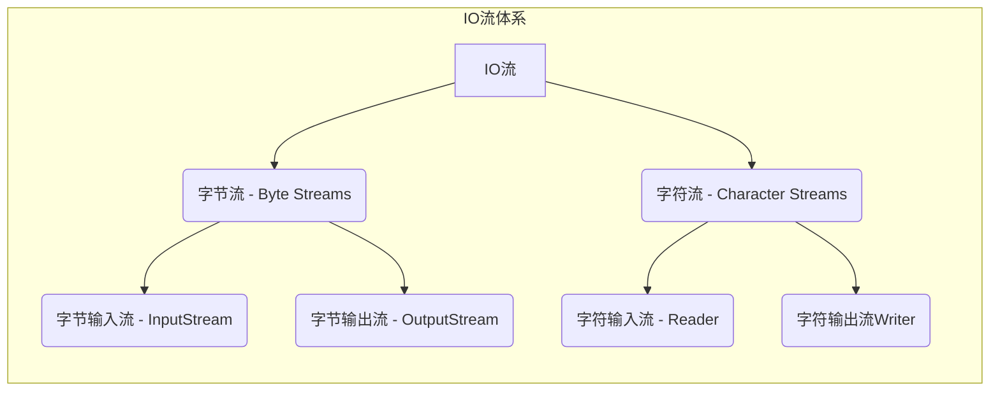
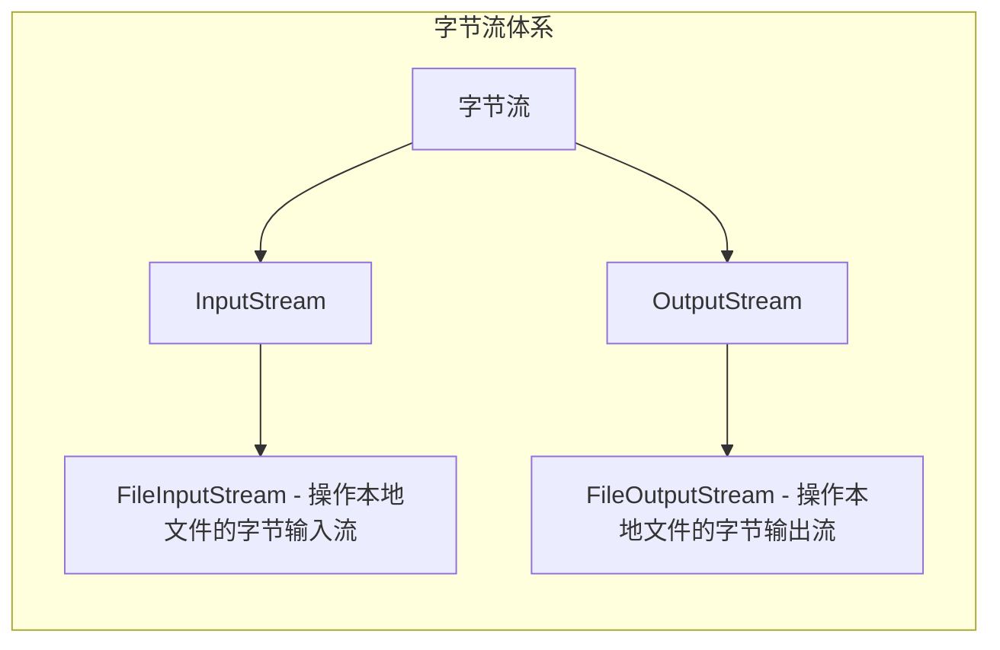

[toc]

### IO流

#### IO流的概述

IO流（输入/输出流）是一种处理数据流的机制，用于在程序和外部设备（如文件或网络连接）之间传输数据。IO流分为**输入流**和**输出流**，用于从外部设备读取数据或向外部设备写入数据。

Java中的IO流主要由**字节流**和**字符流**组成。

* **字节流（Byte Streams）以字节为单位处理数据**。例如，`InputStream`和`OutputStream`是字节流的基本类，用于读取和写入字节数据。字节流可操作所有类型的文件。

* **字符流（Character Streams）以字符为单位处理数据**。例如，Reader和Writer是字符流的基本类，用于读取和写入字符数据。字符流只可操作纯文本文件。
* 纯文本文件可表示为在Windows中用自带的记事本打开且能读懂的文件

Java中的IO流还可分为**节点流**和**处理流**。

* **节点流（Node Streams）直接连接到数据源或数据目标**，如文件或网络连接。即从节点流读取或写入数据，直接与外部设备交互。

* **处理流（Processing Streams）是通过连接到节点流而创建的**。处理流充当节点流的包装器，可以对数据进行额外的处理（如缓冲、过滤或转换），以提供更高级别的功能。

IO流在处理文件操作、网络通信、数据库操作等方面都有广泛应用。通过使用不同的IO流来读写数据，可以使程序实现更灵活的输入输出功能。

#### IO流的体系



#### 字节输出流的基本用法



##### FileOutputStream

操作本地文件的字节输出流，可以把程序中的数据写到本地文件中。

###### 书写步骤与细节

1. 创建字节输出流对象

细节1：参数是字符串表示的路径或者是Fi1e对象都是可以的
细节2：如果文件不存在会创建一个新的文件，但是要保证父级路径是存在的
细节3：如果文件已经存在，则会清空文件

2. 写出数据

细节：write方法的参数是整数，但是实际上写到本地中的是整数在ASCII上对应的字符

3. 释放资源

细节：每次使用完流后都要释放资源

```java
public static void main(String[] args) throws IOException {
    //创建对象
    FileOutputStream fos = new FileOutputStream("指定文件的路径");
    //写出数据
    fos.write(97);//a
    //释放资源
    fos.close();
}
```

###### FileOutputStream原理

FileOutputStream是Java标准库中用于将数据写入文件的类之一。它的原理是通过创建一个字节流连接到文件上，并将数据写入该流，最终写入文件。

具体而言，FileOutputStream操作的流程如下：

1. 创建一个FileOutputStream对象，可以提供文件路径作为参数。
2. 通过调用`write`方法，将数据写入输出流。数据可以是字节数组、字节序列或单个字节。
3. 写入的数据首先缓存在内存中，当缓冲区满（或者在流被关闭时）或`flush`方法被调用时，数据将被刷新并写入到目标文件。
4. 在数据写入完成后，使用`close`方法关闭输出流。关闭输出流会触发刷新缓冲区，确保数据被完全写入目标文件，并释放相关的系统资源。

在FileOutputStream的工作过程中，会涉及到系统I/O的相关操作，如文件系统的读写和缓冲区的管理。因此，在使用FileOutputStream时需要注意异常处理和资源释放，以避免可能的资源泄漏或文件损坏。

###### FileOutputStream写数据的三种方式

| 方法名称                               | 说明                         |
| -------------------------------------- | ---------------------------- |
| void write(int b)                      | 一次写一个字节数据           |
| void write(byte[] b)                   | 一次写一个字节数组数据       |
| void write(byte[] b, int off, int len) | 一次写一个字节数组的部分数据 |

###### 换行和续写

1. 换行：在写入需要换行的位置，插入换行符"\n"。

```java
public class FileOutputStreamExample {
    public static void main(String[] args) {
        String filePath = "example.txt";
        String line1 = "This is line 1";
        String line2 = "This is line 2";

        try (FileOutputStream fos = new FileOutputStream(filePath)) {
            byte[] bytes1 = (line1 + "\n").getBytes();
            byte[] bytes2 = (line2 + "\n").getBytes();

            fos.write(bytes1);
            fos.write(bytes2);

            System.out.println("数据写入成功！");
        } catch (IOException e) {
            System.out.println("数据写入失败：" + e.getMessage());
        }
        
        fos.close();
    }
}
```

2. 续写：在创建`FileOutputStream`对象时，将第二个参数设置为`true`，即追加模式（append mode）。

```java
public class FileOutputStreamExample {
    public static void main(String[] args) {
        String filePath = "example.txt";
        String line1 = "This is line 1";
        String line2 = "This is line 2";

        try (FileOutputStream fos = new FileOutputStream(filePath, true)) {
            byte[] bytes1 = (line1 + "\n").getBytes();
            byte[] bytes2 = (line2 + "\n").getBytes();

            fos.write(bytes1);
            fos.write(bytes2);

            System.out.println("数据续写成功！");
        } catch (IOException e) {
            System.out.println("数据续写失败：" + e.getMessage());
        }
        
        fos.close();
    }
}
```

##### FileInputStream

操作本地文件的字节输入流，可以把本地文件中的数据读取到程序中来

###### 书写步骤与细节

1. 创建字节输入流对象

细节：如果文件不存在，就直接报错

2. 写数据

细节1：一次读一个字节，读出来的是数据在ASCII上对应的数字

细节2：读到文件末尾，read返回-1

3. 释放资源

细节：每次使用完流后必须释放资源

```java
public static void main(String[] args) throws IOException {
    //创建对象
    FileInputStream fis = new FileInputStream("指定文件的路径");
    //读取数据，调用一个read方法，只会读取一个字符
    int b1 = fis.read();
    System.out.prinyln((char)b1);
    //释放资源
    fis.close();
}
```

###### FileInputStream循环读取

```java
public class FileInputStreamExample {
    public static void main(String[] args) throws FileNotFoundException, IOException {
        String filePath = "example.txt";
        FileInputStream fis = new FileInputStream(filePath);
        
        int byteRead;
        //read：表示读取数据，而且是读取一个数据就移动一次指针
        while ((byteRead = fis.read()) != -1) {
            // 打印读取到的字节
            System.out.print((char) byteRead);
        }
        
        System.out.println("\n数据读取完成！");
        
        fis.close();
    }
}
```

#### 文件拷贝

##### 文件拷贝的基本代码

```java
//拷贝小文件
public static void main(String[] args) throws IOException {
    //创建对象
    FileInputStream fis = new FileInputStream("待拷贝文件的目录");
    FileOutputStream fos = new FileOutputStream("拷贝后的文件目录");
    //拷贝
    //核心思想：边读边写
    int b;
    while((b = fis.read()) != -1){
        fos.write(b);
    }
    //释放资源
    //规则：先开的最后关闭
    fos.close();
    fis.close();
}
```

##### FileInputStream读取的问题

如果拷贝的文件过大，那么速度会非常慢，因为拷贝是FileInputStream一次读取一个字节


###### FileInputStream一次读取多个字节

| 方法名称                       | 说明                   |
| ------------------------------ | ---------------------- |
| public int read()              | 一次读一个字节数据     |
| public int read(byte[] buffer) | 一次读一个字节数组数据 |

注意：一次读一个字节数组的数据，每次读取会尽可能把数组装满。


[返回文首](#IO流)
