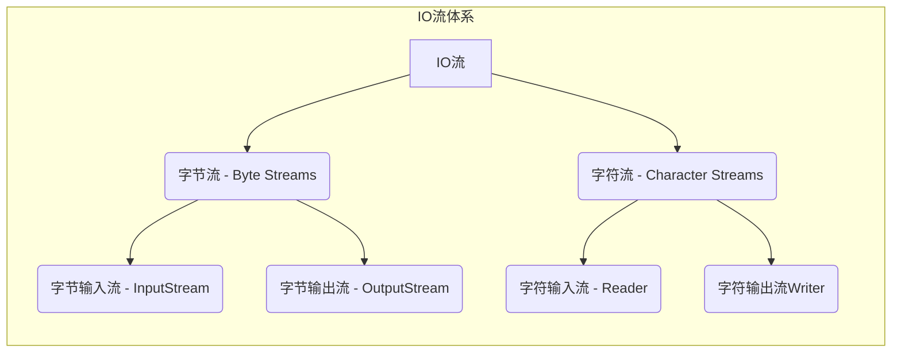
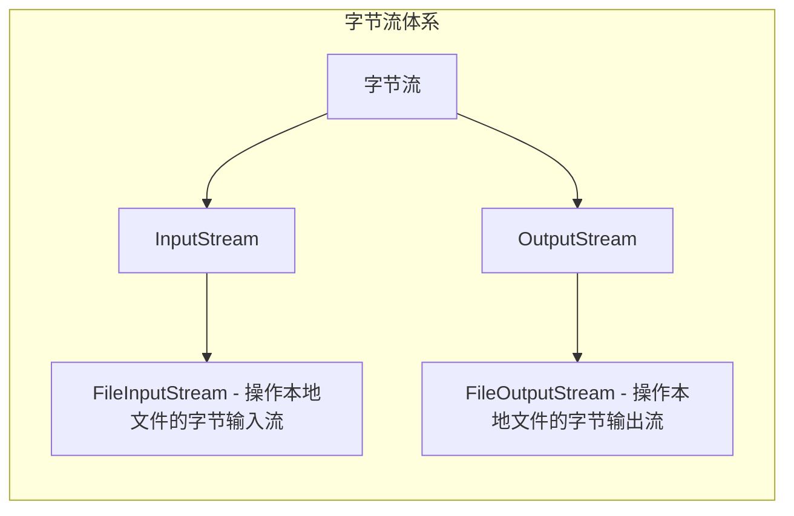
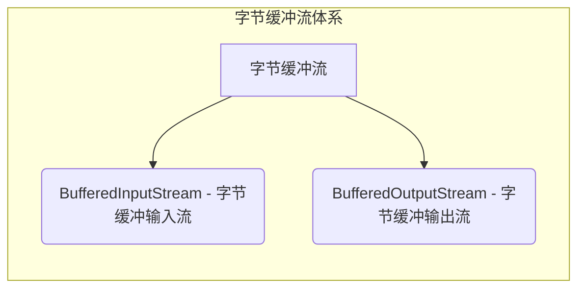
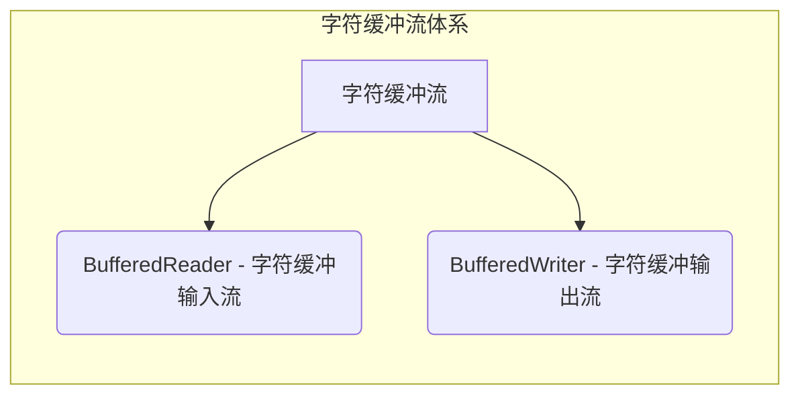

[toc]

# IO流

#### IO流的概述

IO流（输入/输出流）是一种处理数据流的机制，用于在程序和外部设备（如文件或网络连接）之间传输数据。IO流分为**输入流**和**输出流**，用于从外部设备读取数据或向外部设备写入数据。

Java中的IO流主要由**字节流**和**字符流**组成。

* **字节流（Byte Streams）以字节为单位处理数据**。例如，`InputStream`和`OutputStream`是字节流的基本类，用于读取和写入字节数据。字节流可操作所有类型的文件。

* **字符流（Character Streams）以字符为单位处理数据**。例如，Reader和Writer是字符流的基本类，用于读取和写入字符数据。字符流只可操作纯文本文件。
* 纯文本文件可表示为在Windows中用自带的记事本打开且能读懂的文件

Java中的IO流还可分为**节点流**和**处理流**。

* **节点流（Node Streams）直接连接到数据源或数据目标**，如文件或网络连接。即从节点流读取或写入数据，直接与外部设备交互。

* **处理流（Processing Streams）是通过连接到节点流而创建的**。处理流充当节点流的包装器，可以对数据进行额外的处理（如缓冲、过滤或转换），以提供更高级别的功能。

IO流在处理文件操作、网络通信、数据库操作等方面都有广泛应用。通过使用不同的IO流来读写数据，可以使程序实现更灵活的输入输出功能。

#### IO流的体系



#### 字节输出流的基本用法



##### FileOutputStream

操作本地文件的字节输出流，可以把程序中的数据写到本地文件中。

###### 书写步骤与细节

1. 创建字节输出流对象

细节1：参数是字符串表示的路径或者是File对象都是可以的
细节2：如果文件不存在会创建一个新的文件，但是要保证父级路径是存在的
细节3：如果文件已经存在，则会清空文件

2. 写出数据

细节：write方法的参数是整数，但是实际上写到本地中的是整数在ASCII上对应的字符

3. 释放资源

细节：每次使用完流后都要释放资源

```java
public static void main(String[] args) throws IOException {
    //创建对象
    FileOutputStream fos = new FileOutputStream("指定文件的路径");
    //写出数据
    fos.write(97);//a
    //释放资源
    fos.close();
}
```

###### FileOutputStream原理

FileOutputStream是Java标准库中用于将数据写入文件的类之一。它的原理是通过创建一个字节流连接到文件上，并将数据写入该流，最终写入文件。

具体而言，FileOutputStream操作的流程如下：

1. 创建一个FileOutputStream对象，可以提供文件路径作为参数。
2. 通过调用`write`方法，将数据写入输出流。数据可以是字节数组、字节序列或单个字节。
3. 写入的数据首先缓存在内存中，当缓冲区满（或者在流被关闭时）或`flush`方法被调用时，数据将被刷新并写入到目标文件。
4. 在数据写入完成后，使用`close`方法关闭输出流。关闭输出流会触发刷新缓冲区，确保数据被完全写入目标文件，并释放相关的系统资源。

在FileOutputStream的工作过程中，会涉及到系统I/O的相关操作，如文件系统的读写和缓冲区的管理。因此，在使用FileOutputStream时需要注意异常处理和资源释放，以避免可能的资源泄漏或文件损坏。

###### FileOutputStream写数据的三种方式

| 方法名称                               | 说明                         |
| -------------------------------------- | ---------------------------- |
| void write(int b)                      | 一次写一个字节数据           |
| void write(byte[] b)                   | 一次写一个字节数组数据       |
| void write(byte[] b, int off, int len) | 一次写一个字节数组的部分数据 |

###### 换行和续写

1. 换行：在写入需要换行的位置，插入换行符"\n"。

```java
public class FileOutputStreamExample {
    public static void main(String[] args) {
        String filePath = "example.txt";
        String line1 = "This is line 1";
        String line2 = "This is line 2";

        try (FileOutputStream fos = new FileOutputStream(filePath)) {
            byte[] bytes1 = (line1 + "\n").getBytes();
            byte[] bytes2 = (line2 + "\n").getBytes();

            fos.write(bytes1);
            fos.write(bytes2);

            System.out.println("数据写入成功！");
        } catch (IOException e) {
            System.out.println("数据写入失败：" + e.getMessage());
        }
        
        fos.close();
    }
}
```

2. 续写：在创建`FileOutputStream`对象时，将第二个参数设置为`true`，即追加模式（append mode）。

```java
public class FileOutputStreamExample {
    public static void main(String[] args) {
        String filePath = "example.txt";
        String line1 = "This is line 1";
        String line2 = "This is line 2";

        try (FileOutputStream fos = new FileOutputStream(filePath, true)) {
            byte[] bytes1 = (line1 + "\n").getBytes();
            byte[] bytes2 = (line2 + "\n").getBytes();

            fos.write(bytes1);
            fos.write(bytes2);

            System.out.println("数据续写成功！");
        } catch (IOException e) {
            System.out.println("数据续写失败：" + e.getMessage());
        }
        
        fos.close();
    }
}
```

##### FileInputStream

操作本地文件的字节输入流，可以把本地文件中的数据读取到程序中来

###### 书写步骤与细节

1. 创建字节输入流对象

细节：如果文件不存在，就直接报错

2. 写数据

细节1：一次读一个字节，读出来的是数据在ASCII上对应的数字

细节2：读到文件末尾，read返回-1

3. 释放资源

细节：每次使用完流后必须释放资源

```java
public static void main(String[] args) throws IOException {
    //创建对象
    FileInputStream fis = new FileInputStream("指定文件的路径");
    //读取数据，调用一个read方法，只会读取一个字符
    int b1 = fis.read();
    System.out.prinyln((char)b1);
    //释放资源
    fis.close();
}
```

###### FileInputStream循环读取

```java
public class FileInputStreamExample {
    public static void main(String[] args) throws FileNotFoundException, IOException {
        String filePath = "example.txt";
        FileInputStream fis = new FileInputStream(filePath);
        
        int byteRead;
        //read：表示读取数据，而且是读取一个数据就移动一次指针
        while ((byteRead = fis.read()) != -1) {
            // 打印读取到的字节
            System.out.print((char) byteRead);
        }
        
        System.out.println("\n数据读取完成！");
        
        fis.close();
    }
}
```

#### 文件拷贝

##### 文件拷贝的基本代码

```java
//拷贝小文件
public static void main(String[] args) throws IOException {
    //创建对象
    FileInputStream fis = new FileInputStream("待拷贝文件的目录");
    FileOutputStream fos = new FileOutputStream("拷贝后的文件目录");
    //拷贝
    //核心思想：边读边写
    int b;
    while((b = fis.read()) != -1){
        fos.write(b);
    }
    //释放资源
    //规则：先开的最后关闭
    fos.close();
    fis.close();
}
```

##### FileInputStream读取的问题

如果拷贝的文件过大，那么速度会非常慢，因为拷贝是FileInputStream一次读取一个字节


###### FileInputStream一次读取多个字节

| 方法名称                       | 说明                   |
| ------------------------------ | ---------------------- |
| public int read()              | 一次读一个字节数据     |
| public int read(byte[] buffer) | 一次读一个字节数组数据 |

注意：一次读一个字节数组的数据，每次读取会尽可能把数组装满。

```java
public static void main(String[] args) throws IOException {
    /**
     * 文件拷贝
     */
    //1.创建对象
    FileInputStream fis = new FileInputStream("待拷贝文件的目录");
    FileOutputStream fos = new FileOutputStream("拷贝后的文件目录");
    //2.拷贝
    int len;
    byte[] bytes = new byte[1024 * 1024 * 5];
    while((len = fis.read(bytes)) != -1){
        fos.write(bytes, 0, len);
    }
    //3.释放资源
    fos.close();
    fis.close();
}
```

#### IO流中不同JDK版本捕获异常的方式

```java
/**
 * JDK7 : IO流中捕获异常的方法
 * try后面的小括号中写创建对象的代码
 * 注意：只有实现了AutoCloseable接口的类，才能在小括号中创建对象
 */
try(FileInputStream fis = new FileInputStream("待拷贝文件的目录");
    FileOutputStream fos = new FileOutputStream("拷贝后的文件目录")){
    //2.拷贝
    int len;
    byte[] bytes = new byte[1024 * 1024 * 5];
    while((len = fis.read()) != -1){
        fos.write(bytes, 0, len);
    }
} catch (IOException e){
    e.printStackTrace();
}
```

```java
public static void main(String[] args) throws FileNotFoundException {
    /**
     * JDK9 : IO流中捕获异常的方法
     */
    FileInputStream fis = new FileInputStream("待拷贝文件的目录");
    FileOutputStream fos = new FileOutputStream("拷贝后的文件目录");
    try(fis; fos){
        //2.拷贝
        int len;
        byte[] bytes = new byte[1024 * 1024 * 5];
        while((len = fis.read()) != -1){
            fos.write(bytes, 0, len);
        }
    } catch (IOException e){
        e.printStackTrace();
    }
}
```

#### 字符集

了解

1. ASCII、GBK、Unicode
2. 乱码的产生与注意事项

#### 编码和解码的代码实现

编码的方法

| String类中的方法                           | 说明                 |
| ------------------------------------------ | -------------------- |
| public byte[] getBytes()                   | 使用默认方式进行编码 |
| public byte[] getBytes(String charsetName) | 使用指定方式进行编码 |

解码的方法

| String类中的方法                         | 说明                 |
| ---------------------------------------- | -------------------- |
| String(byte[] bytes)                     | 使用默认方式进行解码 |
| String(byte[] bytes, String charsetName) | 使用指定方式进行解码 |

```java
//编码
String str1 = "待编码文本";
byte[] bytes = str1.getBytes("UTF-8");
System.out.println(Arrays.toString(bytes));
//解码
String str2 = new String(bytes, "UTF-8");
System.out.println(str2)
```

#### 字符流

```markdown
	字符流底层就是字节流
	字符流 = 字节流 + 字符集
```

##### 特点

* 输入流：一次读一个字节，遇到中文时，根据其字符集判断读取多少个字节

* 输出流：底层会把数据按照指定的编码方式进行编码，变成字节再写道文件中

##### 使用场景

* 对于纯文本文件进行读写操作

##### 字符输入流

###### FileReader

1. 创建字符输入流对象

| 构造方法                           | 说明                       |
| ---------------------------------- | -------------------------- |
| public FileReader(File file)       | 创建字符输入流关联本地文件 |
| public FileReader(String pathname) | 创建字符输入流关联本地文件 |

2. 读取数据

| 成员方法                       | 说明                         |
| ------------------------------ | ---------------------------- |
| public int read()              | 读取数据，读到末尾返回-1     |
| public int read(char[] buffer) | 读取多个数据，读到末尾返回-1 |

* 细节1：按字节进行读取，遇到中文，一次读多个字节，读取后解码，返回一个整数
* 细节2：读到文件末尾了，read方法返回-1

3. 释放资源

| 成员方法           | 说明            |
| ------------------ | --------------- |
| public int close() | 释放资源 / 关流 |

**空参`read()`方法**

```java
public static void main(String[] args) throws IOException {
    //创建对象并关联本地文件
    FileReader fr = new FileReader("文件目录");

    /**
     * 读取数据read()
     * read()细节：
     *      1.read()：默认是逐个字节读取，如果遇到中文就会一次读取多个
     *      2.在读取后，方法底层还会进行解码并转成十进制，最终会把十进制做为返回值
     *        十进制数据也是表示在字符集上的数字
     *      例如：文件里的中文的二进制数据：11100110 10110001 1000101
     *           read方法进行读取，解码并转成十进制27721
     * 那么，如果想看到所对应的汉字，就把十进制数据强转成char类型
     */
    int ch;
    while((ch = fr.read()) != -1){
        System.out.println((char) ch);
    }

    //3.释放资源
    fr.close();
}
```

**有参`read()`方法**

```java
public static void main(String[] args) throws IOException {
    //1.创建对象
    FileReader fr = new FileReader("文件目录");
    //2.读取数据
    char[] chars = new char[2];
    int len;
    //read(chars)：有参read()把读取数据、解码、强转三步合并，把强转之后的字符放到数组当中
    //有参的read方法：空参的read + 强转类型转换
    while((len = fr.read(cha)) != -1){
        System.out.println(new String(chars, 0, len));
    }
    //3.释放类型
    fr.close();
}
```

##### 字符输出流

###### FileWriter构造方法

| 构造方法                                           | 说明                             |
| -------------------------------------------------- | -------------------------------- |
| public FileWriter(File file)                       | 创建字符输出流关联本地文件       |
| public Filewriter(String pathname)                 | 创建字符输出流关联本地文件       |
| public Filewriter(File file, boolean append)       | 创建字符输出流关联本地文件，续写 |
| public Filewriter(String pathname, boolean append) | 创建字符输出流关联本地文件，续写 |

###### FileWriter成员方法

| 成员方法                                  | 说明                   |
| ----------------------------------------- | ---------------------- |
| void write(int c)                         | 写出一个字符           |
| void write(string str)                    | 写出一个字符串         |
| void write(String str, int off, int len)  | 写出一个字符串的一部分 |
| void write(char[] cbuf)                   | 写出一个字符数组       |
| void write(char[] cbuf, int off, int len) | 写出字符数组的一部分   |

###### FileWriter书写细节

1. 创建字符输出流对象

细节1：参数是字符串表示的路径或者File对象都是可以的
细节2：如果文件不存在会创建一个新的文件，但是要保证父级路径是存在的
细节3：如果文件已经存在，则会清空文件，加里不想清空可以打开续写开关

2. 写数据

细节：如果wite方法的参数是整数，但是实际上写到本地文件中的是整数在字符集上对应的字符

3. 释放数据

细节：每次使用完流之后都要释放资源

##### 字符流原理解析

###### 字符输入流底层原理

```markdown
1.创建字符输入对象
    底层：关联文件，并创建缓冲区（长度为8192的字节数组）

2.读取数据
	底层：1.判断缓冲区中是否有数据可以读取
	     2.缓冲区没有数据：就从文件中获取数据，装到缓冲区中，每次尽可能装满缓冲区。如果文件中也没有数据，返回-1
		 3.缓冲区有数据：就从缓冲区读取
空参的read方法：一次读取一个字节，遇到中文一次读多个字节，把字节解码并转成十进制返回
有参的read方法：把读取字节，解码，强转三步合并了，强转之后的字符放到数组中
```

###### 字符输出流底层原理

| 成员方法            | 说明                               |
| ------------------- | ---------------------------------- |
| public void flush() | 将缓冲区中的数据，刷新到本地文件中 |
| public void close() | 释放资源/关流                      |

* fush刷新：刷新之后，还可以继续往文件中写出数据
* close关流：断开通道，无法再往文件中写出数据

##### 字节流和字符流的使用场景

```markdown
字节流
	拷贝任意类型的文件
字符流
	读取纯文本文件中的数据
	往纯文本文件中写出数据
```

##### 案例

###### 拷贝文件夹

```java
public static void main(String[] args) throws IOException {
    /**
     * 拷贝多级文件夹
     */

    //1.创建待拷贝文件路径和文件拷贝后的文件路径
    File file = new File("C:\\Users\\JunXing\\Desktop\\Typora学习笔记");
    File newFile = new File("C:\\Users\\JunXing\\Desktop\\01");

    //2.创建文件拷贝方法
    fileCopy(file, newFile);
}

private static void fileCopy(File file, File newFile) throws IOException{

    newFile.mkdirs();

    //3.进入待拷贝文件夹
    File[] listFiles = file.listFiles();
    //4.判断待拷贝文件是文件还是文件夹
    for (File listFile : listFiles) {
        //4.1.如果是文件
        if(listFile.isFile()){
            //4.1.1.如果是文件则拷贝进入新文件夹
            //使用FileInputStream从文件夹中读取内容
            FileInputStream fis = new FileInputStream(listFile);
            //FileOutputStream fos = new FileOutputStream(newFile);
            //在这里，我们使用 listFile 对象作为要读取的文件对象，
            //并使用 new File(newFile, listFile.getName()) 来创建要写入的新文件对象。这样做可以确保将文件拷贝到目标文件夹中。
            FileOutputStream fos = new FileOutputStream(new File(newFile, listFile.getName()));
            int len; //记录读取的字节长度
                     //如果len != -1，说明读取到了内容；如果len = -1，说明没有内容读取
            byte[] bytes = new byte[1024];
            while((len = fis.read(bytes)) != -1){
                fos.write(bytes, 0, len);
            }
            //4.1.2.释放资源
            fos.close();
            fis.close();
        } else {
            //4.2.如果是文件夹
            //4.2..1.如果是文件夹则递归判断下一个文件
            fileCopy(listFile, new File(newFile, listFile.getName()));
        }
    }
}
```

###### 加密和解密文件

```java
final static String OLDFILE = "C:\\Users\\JunXing\\Desktop\\02";
final static String NEWFILE = "C:\\Users\\JunXing\\Desktop\\01";
public static void main(String[] args) throws IOException{
    /**
     * 文件的加密与解密
     */
    //1.创建原始文件对象
    File file = new File(OLDFILE);
    File newfile = new File(NEWFILE);

    encryptFile(file, newfile);
}

private static void encryptFile(File file, File newFile) throws IOException {

    newFile.mkdirs();

    //1.文件加密
    //2.进入目标文件夹
    File[] listFiles = file.listFiles();
    //3.循环判断内容是文件夹还是文件
    for (File listFile : listFiles) {
        if (listFile.isFile()) {
            //4.内容是文件
            //4.1.文件加密（异或一个数）
            //4.2.文件解密（异或同一个数）
            FileInputStream fis = new FileInputStream(listFile);
            FileOutputStream fos = new FileOutputStream(new File(newFile, listFile.getName()));

            byte[] bytes = new byte[1024];
            int len;
            while((len = fis.read(bytes)) != -1){
                for (int i = 0; i < len; i++) {
                    bytes[i] = (byte) (bytes[i] ^ 10);
                }
                //写入修改后数据
                fos.write(bytes, 0, len);
            }
            fis.close();
            fos.close();
        } else {
            //5.内容是文件夹
            //5.1.递归处理
            encryptFile(listFile, new File(newFile, listFile.getName()));
        }
    }
}
```

###### 修改文件数据

```java
public static void main(String[] args) throws IOException {
    //1.读取数据
    //2-1-9-4-7-8
    FileReader fr = new FileReader("src/m11d14/a.txt");
    StringBuilder sb = new StringBuilder();

    int ch;
    while((ch = fr.read()) != -1){
        sb.append((char)ch);
    }
    fr.close();

    //2.排序
    String str = sb.toString();
    String[] arrStr = str.split("-");

    ArrayList<Integer> list = new ArrayList<>();
    for (String s : arrStr) {
        int i = Integer.parseInt(s);
        list.add(i);
    }
    Collections.sort(list);
    System.out.println(list);

    //3.写出
    FileWriter fw = new FileWriter("src/m11d14/a.txt");
    for (int i = 0; i < list.size(); i++) {
        if(i == list.size() - 1){
            fw.write(list.get(i) + "");
        } else {
            fw.write(list.get(i) + "-");
        }
    }
    fw.close();
}
```

```java
public static void main(String[] args) throws IOException {
    //1.读取数据
    //2-1-9-4-7-8
    FileReader fr = new FileReader("src/m11d14/a.txt");
    StringBuilder sb = new StringBuilder();
    int ch;
    while((ch = fr.read()) != -1){
        sb.append((char)ch);
    }
    fr.close();
    System.out.println(sb);

    //2.排序
    Integer[] arr = Arrays.stream(sb.toString().split("-"))
            .map(Integer::parseInt)
            .sorted()
            .toArray(Integer[]::new);

    //3.写出
    FileWriter fw = new FileWriter("src/m11d14/a.txt");
    String s = Arrays.toString(arr).replace(", ", "-");
    String result = s.substring(1, s.length() - 1);
    fw.write(result);
    fw.close();
}
```

#### 字节流和字符流的区别

在Java的IO流体系中，字节流和字符流是两种不同的流类型，主要区别如下：

1. 处理数据类型：字节流以字节为单位进行读写操作，适用于二进制数据（如图片、音频、视频等）和文本数据。字符流以字符为单位进行读写操作，适用于处理文本数据。
2. 输入输出方式：字节流以字节流的方式进行输入输出，通常用于处理二进制数据或字节流。字符流以字符流的方式进行输入输出，通常用于处理文本数据。
3. 编码方式：字节流不关心数据的具体编码方式，可以直接处理原始数据，适用于处理任意编码的数据。字符流则依赖于具体的编码方式，基于字符集进行编码和解码操作，默认使用平台默认的字符集。
4. 处理效率：字节流处理数据的效率通常比字符流高。因为字符流需要进行字符编码和解码的过程，而字节流直接处理原始数据，少了编码解码的开销。

#### 知识点：StringBuilder

`StringBuilder` 是一个可变的字符串类，它允许在已有字符串的基础上进行字符串的修改和拼接操作，而不会创建新的字符串对象。它属于 `java.lang` 包，常用于需要频繁修改字符串内容的场景。

使用 `StringBuilder` 类可以有效地避免频繁创建字符串对象，提高字符串操作的性能。下面是创建 `StringBuilder` 对象并进行常见操作的示例代码：

```java
// 创建空的 StringBuilder 对象
StringBuilder sb = new StringBuilder();

// 追加字符串
sb.append("Hello");

// 在指定位置插入字符串
sb.insert(5, " World");

// 替换字符串
sb.replace(6, 11, "Java");

// 删除指定位置的字符
sb.deleteCharAt(5);

// 删除指定范围内的字符
sb.delete(5, 9);

// 反转字符串
sb.reverse();

// 获取最终结果
String result = sb.toString();

System.out.println(result); // 输出：avaJ
```

#### 缓冲流

##### 字节缓冲流



**原理**：底层自带了长度为8192的缓冲区提高性能

| 方法名称                                     | 说明                                     |
| -------------------------------------------- | ---------------------------------------- |
| public BufferedInputStream(InputStream is)   | 把基本流包装成高级流，提高读取数据的性能 |
| public BufferedOutputStream(OutputStream os) | 把基本流包装成高级流，提高写出数据的性能 |

###### 利用字节缓冲流拷贝文件

**一次读写一个字节**

```java
public static void main(String[] args) throws IOException {
    //1.创建缓冲流的对象
    BufferedInputStream bis = new BufferedInputStream(new FileInputStream("example.txt"));
    BufferedOutputStream bos = new BufferedOutputStream(new FileOutputStream("copy.txt"));

    //2.循环读取并写到目的地
    int b;
    while((b = bis.read()) != -1){
        bos.write(b);
    }
    //释放资源
    bos.close();
    bis.close();
}
```

**一次读写多个字节**

```java
public static void main(String[] args) throws IOException {
    BufferedInputStream bis = new BufferedInputStream(new FileInputStream("example.txt"));
    BufferedOutputStream bos = new BufferedOutputStream(new FileOutputStream("copy.txt"));
    byte[] bytes = new byte[1024];
    int len;
    while((len = bis.read(bytes)) != -1){
        bos.write(bytes, 0, len);
    }
    bos.close();
    bis.close();
}
```

###### 字节缓冲流提高效率的原理


```markdown
	真正节约的是：读写的时候跟硬盘打交道的时间，让数据在内存中实现读写
```

##### 字符缓冲流



**原理：**底层自带了长度为8192的缓冲区提高性能

###### 字符缓冲流的构造方法

| 方法名称                        | 说明               |
| ------------------------------- | ------------------ |
| public BufferedReader(Reader r) | 把基本流变成高级流 |
| public Bufferedwriter(Writer r) | 把基本流变成高级流 |

###### 字符缓冲流特有方法

| 字符缓冲输入流特有方法   | 说明                                         |
| ------------------------ | -------------------------------------------- |
| public String readLine() | 读取一行数据，如果没有数据可读了，会返回null |

| 字符缓冲输出流特有方法 | 说明         |
| ---------------------- | ------------ |
| public void newLine()  | 跨平台的换行 |

```java
public static void main(String[] args) throws IOException {
    BR();
    BW();
}

private static void BW() throws IOException{
    //BufferedWriter bw = new BufferedWriter(new FileWriter("copy.txt"));
    //开启续写
    BufferedWriter bw = new BufferedWriter(new FileWriter("copy.txt", true));

    bw.write("bw.write line 1");
    bw.newLine();
    bw.write("bw.write line 2");

    bw.close();
}

private static void BR() throws IOException {
    //创建字符缓冲输入流的对象
    BufferedReader br = new BufferedReader(new FileReader("example.txt"));
    //读取数据
    //readLine方法在读取时，一次读取一行，遇到回车换行结束
    //      但是不会把回车换行读到内存中
    String line;
    while((line = br.readLine()) != null){
        System.out.println(line);
    }
    br
}
```

###### 总结

1. 缓冲流有几种？

* 字节缓冲输入流：BufferedInputStream
* 字节缓冲输出流：BufferedOutputStream
* 字符缓冲输入流：BufferedReader
* 字符缓冲输出流：BufferedWriter

2. 缓冲流为什么能提高性能？

* 缓冲流自带长度为8192的缓冲区
* 可以显著提高字节流的读写性能
* 对于字符流提升不明显，对于字符缓冲流而言关键点是两个特有的方法

3. 字符缓冲流两个特有的方法是什么？

* 字符缓冲输入流`BufferedReader:  readLine()`

* 字符缓冲输出流`BufferedWriter:  newLine()`

##### 补充知识：`FileInputStream read(byte[] buffer)` 方法和 `FileInputStream read()` 方法的返回值有两个主要区别

1. `read(byte[] buffer)` 方法返回的是实际读取的字节数，而 `read()` 方法返回的是读取的字节数据的值。
   - `read(byte[] buffer)` 方法将尽可能多地从输入流中读取字节，并将其存储在指定的缓冲区中。返回的是成功读取的字节数，如果已经到达文件末尾则返回 -1。
   - `read()` 方法将从输入流中读取下一个字节，并返回一个介于 0 到 255 之间的整数，表示读取的字节数据的值。如果已经到达文件末尾则返回 -1。
2. `read(byte[] buffer)` 方法是用于读取多个字节的方法，而 `read()` 方法是用于读取单个字节的方法。
   - `read(byte[] buffer)` 方法可以一次性读取多个字节，并将其存储在指定的缓冲区中，以提高读取的效率。
   - `read()` 方法每次只能读取一个字节。如果需要读取多个字节，则需要在循环中多次调用该方法。

##### 案例

###### 四种拷贝方式效率对比

```java
public static void main(String[] args) throws IOException {
    File oldFile = new File("C:\\Users\\JunXing\\Desktop\\Typora学习笔记");
    File newFile = new File("C:\\Users\\JunXing\\Desktop\\copy");

    long startTime1 = System.currentTimeMillis();
    //字节流的基本流：一次读取一个字节
    ByteStreamOfByte(oldFile, newFile);
    long endTime1 = System.currentTimeMillis();
    System.out.println("ByteStreamOfByte():" + (endTime1 - startTime1));

    long startTime2 = System.currentTimeMillis();
    //字节流的基本流：一次读写一个字节数组
    ByteStreamOfBytes(oldFile, newFile);
    long endTime2 = System.currentTimeMillis();
    System.out.println("ByteStreamOfBytes():" + (endTime2 - startTime2));//1974

    long startTime3 = System.currentTimeMillis();
    //字节缓冲流：一次读写一个字节
    ByteBufferedStreamOfByte(oldFile, newFile);
    long endTime3 = System.currentTimeMillis();
    System.out.println("ByteBufferedStreamOfByte():" + (endTime3 - startTime3));//1556

    long startTime4 = System.currentTimeMillis();
    //字节缓冲流：一次读写一个字节
    ByteBufferedStreamOfBytes(oldFile, newFile);
    long endTime4 = System.currentTimeMillis();
    System.out.println("ByteBufferedStreamOfBytes:" + (endTime4 - startTime4));//1091
}

private static void ByteBufferedStreamOfBytes(File oldFile, File newFile) throws IOException{

    newFile.mkdirs();

    File[] listFiles = oldFile.listFiles();
    for (File listFile : listFiles) {
        if (listFile.isFile()){
            BufferedInputStream bis = new BufferedInputStream(new FileInputStream(listFile));
            BufferedOutputStream bos = new BufferedOutputStream(new FileOutputStream(new File(newFile, listFile.getName())));
            int len;
            byte[] bytes = new byte[1024];
            while((len = bis.read(bytes)) != -1){
                bos.write(bytes, 0, len);
            }
            bos.close();
            bis.close();
        } else {
            ByteBufferedStreamOfBytes(listFile, new File(newFile, listFile.getName()));
        }
    }
}

private static void ByteBufferedStreamOfByte(File oldFile, File newFile) throws IOException{

    newFile.mkdirs();

    File[] listFiles = oldFile.listFiles();
    for (File listFile : listFiles) {
        if (listFile.isFile()){
            BufferedInputStream bis = new BufferedInputStream(new FileInputStream(listFile));
            BufferedOutputStream bos = new BufferedOutputStream(new FileOutputStream(new File(newFile, listFile.getName())));
            int b;
            while((b = bis.read()) != -1){
                bos.write(b);
            }
            bos.close();
            bis.close();
        } else {
            ByteBufferedStreamOfByte(listFile, new File(newFile, listFile.getName()));
        }
    }
}

private static void ByteStreamOfBytes(File oldFile, File newFile) throws IOException{

    newFile.mkdirs();

    File[] listFiles = oldFile.listFiles();
    for (File listFile : listFiles) {
        if(listFile.isFile()){
            //字节流的基本流：一次读取一个字节
            FileInputStream fis = new FileInputStream(listFile);
            FileOutputStream fos = new FileOutputStream(new File(newFile, listFile.getName()));
            int len;
            byte[] bytes = new byte[1024];
            //FileInputStream 的 read() 方法用于从输入流中读取一个字节，并返回读取的字节数据。
            //其返回值是一个 int 类型的整数，表示读取的字节数据的值
            while((len = fis.read(bytes)) != -1){
                fos.write(bytes, 0, len);
            }
            //释放资源
            fos.close();
            fis.close();
        } else {
            ByteStreamOfBytes(listFile, new File(newFile, listFile.getName()));
        }
    }
}

private static void ByteStreamOfByte(File oldFile, File newFile) throws IOException{

    newFile.mkdirs();

    File[] listFiles = oldFile.listFiles();
    for (File listFile : listFiles) {
        if(listFile.isFile()){
            //字节流的基本流：一次读取一个字节
            FileInputStream fis = new FileInputStream(listFile);
            FileOutputStream fos = new FileOutputStream(new File(newFile, listFile.getName()));
            int len;
            //FileInputStream 的 read() 方法用于从输入流中读取一个字节，并返回读取的字节数据。
            //其返回值是一个 int 类型的整数，表示读取的字节数据的值
            while((len = fis.read()) != -1){
                fos.write(len);
            }
            //释放资源
            fos.close();
            fis.close();
        } else {
            ByteStreamOfByte(listFile, new File(newFile, listFile.getName()));
        }
    }
}
```

###### 根据序号恢复文本顺序

```java
public static void main(String[] args) throws IOException {
    //读取数据
    BufferedReader br = new BufferedReader(new FileReader("csb.txt"));
    String line;
    ArrayList<String> list = new ArrayList<>();
    while((line = br.readLine()) != null){
        list.add(line);
    }
    br.close();

    //排序
    //按照每一行前的序号进行排序
    Collections.sort(list, new Comparator<String>() {
        @Override
        public int compare(String o1, String o2) {
            int i1 = Integer.parseInt(o1.split("\\.")[0]);
            int i2 = Integer.parseInt(o2.split("\\.")[0]);
            return i1 - i2;
        }
    });

    //3.写出
    BufferedWriter bw = new BufferedWriter(new FileWriter("result.txt"));
    for (String str : list) {
        bw.write(str);
        bw.newLine();
    }
    br.close();
}
```

```java
public static void main(String[] args) throws IOException {
    BufferedReader br = new BufferedReader(new FileReader("csb.txt"));
    String line;
    TreeMap<Integer, String> treeMap = new TreeMap<>();
    while((line = br.readLine()) != null){
        String[] arr = line.split("\\.");
        treeMap.put(Integer.parseInt(arr[0]), arr[1]);
    }
    br.close();

    BufferedWriter bw = new BufferedWriter(new FileWriter("result.txt"));
    Set<Map.Entry<Integer, String>> entries = treeMap.entrySet();
    for (Map.Entry<Integer, String> entry : entries) {
        String value = entry.getValue();
        bw.write(value);
        bw.newLine();
    }
    bw.close();
}
```

#### 转换流

**作用：**是字符流和字节流之间的桥梁


##### 转换文件编码

###### 利用转换流按照指定字符编码读取与写出

```java
FileReader fr = new FileReader("目标文件.txt", Charset.forName("GBK"));
//2.读取数据
int ch;
while((ch = fr.read()) != -1){
    System.out.println((char) ch);
}
//3.释放资源
fr.close();
```

```java
FileWriter fw = new FileWriter("目标文件.txt", Charset.forName("GBK"));
fw.write("fw.writer line 1");
fw.close();
```

###### 将本地文件中的GBK文件，转成UTF-8

```java
//JDK11以前的方案
InputStreamReader isr = new InputStreamReader(new FileInputStream("目标文件.txt"), "GBK");
int ch;
OutputStreamWriter osw = new OutputStreamWriter(new FileOutputStream("copy.txt"), "UTF-8");
while((ch = isr.read()) != -1){
    osw.write(ch);
}
osw.close();
isr.close();

//JDK11以后的方案
FileReader fr = new FileReader("目标文件.txt", Charset.forName("GBK"));
int len;
FileWriter fw = new FileWriter("copy.txt", Charset.forName("UTF-8"));
while((len = fr.read()) != -1){
    fw.write(len);
}
fw.close();
fr.close();
```

###### 利用字节流读取文件数据，每次读取一行，且无乱码

```java
BufferedReader br = new BufferedReader(new InputStreamReader(new FileInputStream("目标文件.txt")));
String line;
while((line = br.readLine()) != null){
    System.out.println(line);
}
br.close();
```

##### 总结

```markdown
1.转换流的名字是什么？
    字符转换输入流：InputStreamReader
    字符转换输出流：OutputStreamWriter
2.转换流的作用是什么？
    指定字符集读写数据(JDK11之后已淘汰)
    字节流想要使用字符流中的方法
```

#### 序列化流 / 对象操作输出流

* 可以把Java中的对象写到本地文件中

| 构造方法                                    | 说明                 |
| ------------------------------------------- | -------------------- |
| public ObjectOutputStream(OutputStream out) | 把基本流包装成高级流 |

| 成员方法                                  | 说明                 |
| ----------------------------------------- | -------------------- |
| public final void writeObject(Object obj) | 把对象序列化到文件中 |

###### 注意点

使用对象输出流将对象保存到文件时会出现<font color="red">NotSerializableException</font>异常

解决方案：让<font color="red">Javabean类</font>实现Serializable接口

```markdown
Serializable接口里时没有抽象方法的，是标记性接口
一旦实现了这个接口，那么就表示当前的Student类可以被序列化
```

###### 实现

```java
private static void SerializationStream() throws IOException {
    //创建对象
    Student stu = new Student("zhangsan", 23);
    //创建序列化流的对象
    ObjectOutputStream oos = new ObjectOutputStream(new FileOutputStream("SerializationStream.txt"));
    //写出数据
    oos.writeObject(stu);
    //释放资源
    oos.close();
}
```

##### 反序列化流 / 对象操作输入流

* 可以把序列化到本地文件中的对象，读取到程序中来

| 构造方法                                  | 说明               |
| ----------------------------------------- | ------------------ |
| public ObjectInputStream(InputStream out) | 把基本流变成高级流 |

| 成员方法                                 | 说明                                   |
| ---------------------------------------- | -------------------------------------- |
| public final void readObject(Object obj) | 读取被序列化的对象，将其反序列化为对象 |

###### 实现

```java
private static void DeserializationStream() throws IOException, ClassNotFoundException {
    //创建反序列化流的对象
    ObjectInputStream ois = new ObjectInputStream(new FileInputStream("SerializationStream.txt"));
    //读取数据
    Object o = ois.readObject();
    //打印对象
    System.out.println(o);
    //释放资源
    ois.close();
}
```

###### 关于版本号serialVersionUID的细节

1. `serialVersionUID` 是一个用来标识序列化类的版本的唯一标识符。
2. 每个可序列化的类都应该包含 `serialVersionUID` 字段。
3. 版本号的作用是用来验证序列化对象和反序列化对象之间的兼容性。
4. 当序列化对象被写入到文件或网络中，并在以后的某个时间点进行反序列化时，反序列化过程会根据对象的版本号来判断是否与当前版本的类兼容。
5. 如果版本号相同，则可以正常进行反序列化。如果版本号不同，则可能会导致反序列化失败，抛出异常。
6. 类结构的改变，包名或类名的改变以及序列化类的版本号与反序列化时使用的类的版本号不一致，都可能导致版本号不同，从而导致反序列化失败。
7. 如果在类更新之前设置了 `serialVersionUID` 的值，并且在类更新后没有手动更新该值，仍然可以成功地反序列化，因为 `serialVersionUID` 的值不发生变化。
8. 如果在更新类结构后手动更新 `serialVersionUID` 的值，即使类的结构没有发生变化，也可能导致反序列化失败，因为 `serialVersionUID` 的值被视为不匹配。
9. 因此，在类结构发生变化时，建议手动更新 `serialVersionUID` 的值，以确保反序列化的兼容性。

###### 序列化流/反序列化流的细节汇总

1. 使用序列化流将对象写到文件时，需要让)avabean类实现Serializable接口。
   否则，会出现NotSerializableException.异常

2. 序列化流写到文件中的数据是不能修改的，一旦修改就无法再次读回来了

3. 序列化对象后，修改了)avabean类，再次反序列化，会不会有问题？
   会出问题，会抛出<font color="red">InvalidClassException异常</font>
   <font color="red">解决方案：</font>给avabean:类添加serialVersionUID（序列号、版本号)

4. 如果一个对象中的某个成员变量的值不想被序列化，又该如何实现呢？
   <font color="red">解决方案：</font>给该成员变量加<font color="red">transient关键字</font>修饰，该关键字标记的成员变量不参与序列化过程

###### 案例 --- 读写多个对象

```java
public static void main(String[] args) throws IOException, ClassNotFoundException {
    /**
     * 读写多个对象
     */
    SS();

    DS();
}
private static void DS() throws IOException, ClassNotFoundException {

    //创建反序列化流的对象
    ObjectInputStream ois = new ObjectInputStream(new FileInputStream("SS.txt"));
    //读取数据
    ArrayList<Student> list = (ArrayList<Student>) ois.readObject();

    for (Student student : list) {
        System.out.println(student);
    }
}
private static void SS() throws IOException {
    Student s1 = new Student("zhangsan", 23, "NJ");
    Student s2 = new Student("lisi", 24, "CQ");
    Student s3 = new Student("wangwu", 25, "BJ");

    ArrayList<Student> list = new ArrayList<>();
    Collections.addAll(list, s1, s2, s3);

    ObjectOutputStream oos = new ObjectOutputStream(new FileOutputStream("SS.txt"));
    oos.writeObject(list);

    oos.close();
}
```

#### 打印流

* <font color="red">分类：</font>打印流一般是指：PrintStream，PrintWriter两个类
* <font color="red">特点</font>
  * 打印流只操作文件目的地，不操作数据源
  * 特有的写出方法可以实现，数据原样写出
  * 特有的写出方法，可以实现自动刷新，自动换行；打印一次数据 = 写出+换行+刷新

##### 字节打印流

| 构造方法                                                     | 说明                         |
| ------------------------------------------------------------ | ---------------------------- |
| public PrintStream(OutputStream/File/String)                 | 关联字节输出流/文件/文件路径 |
| public Printstream(String fileName,Charset charset)          | 指定字符编码                 |
| public Printstream(OutputStream out,boolean autoFlush)       | 自动刷新                     |
| public Printstream(Outputstream out,boolean autoFlush,String encoding) | 指定字符编码且自动刷新       |

<center><font color="red">字节流底层没有缓冲区，开不开自动刷新都一样</font></center>

| 成员方法                                        | 说明                                       |
| ----------------------------------------------- | ------------------------------------------ |
| public void write(int b)                        | 常规方法：规则跟之前一样，将指定的字节写出 |
| public void println(Xxx xx)                     | 特有方法：打印任意数据，自动刷新，自动换行 |
| public void print(Xxx xx)                       | 特有方法：打印任意数据，不换行             |
| public void printf(String format,object...args) | 特有方法：带有占位符的打印语句，不换行     |

##### 字符打印流

| 构造方法                                                     | 说明                         |
| ------------------------------------------------------------ | ---------------------------- |
| public Printwriter(Write/File/String)                        | 关联字节输出流/文件/文件路径 |
| public PrintWriter(String fileName, Charset charset)         | 指定字符编码                 |
| public Printwriter(Write w, boolean autoFlush)               | 自动刷新                     |
| public PrintWriter(OutputStream out, boolean autoFlush, Charsetcharset) | 指定字符编码且自动刷新       |

<center><font color="red">字符流底层有缓冲区，想要自动刷新需要开启</font></center>

| 成员方法                                        | 说明                                         |
| ----------------------------------------------- | -------------------------------------------- |
| public void write(...)                          | 常规方法：规则跟之前一样，写出字节或者字符串 |
| public void println(Xxx xx)                     | 特有方法：打印任意类型的数据并且换行         |
| public void print(Xxx xx)                       | 特有方法：打印任意类型的数据，不换行         |
| public void printf(String format,Object...args) | 特有方法：带有占位符的打印语句               |

#### 解压缩流 / 压缩流

##### 解压缩流

ZipEntry：压缩包里的每一个文件

<font color="red">解压本质：</font>把每一个ZipEntry按照层级拷贝到本地的目的文件夹中

###### 案例-解压ZIP压缩文件

```java
public static void main(String[] args) throws IOException{
    File src = new File("D:\\EdgeDownloads\\apache-jmeter-5.5.zip");
    File dest = new File("D:\\EdgeDownloads");

    decompressStream(src, dest);
}

private static void decompressStream(File src, File dest) throws IOException {
    //创建解压缩流用来读取压缩包中的数据
    ZipInputStream zis = new ZipInputStream(new FileInputStream(src));

    //表示当前在压缩包中获取到的文件夹或者文件
    ZipEntry entry;
    while ((entry = zis.getNextEntry()) != null) {
        //判断是否为文件夹
        if(entry.isDirectory()){
            //如为文件夹
            File file = new File(dest, entry.toString());
            file.mkdirs();
        } else {
            //如为文件：需要读取到压缩包中的文件，并存放到目的文件夹中（按照层级目录）
            FileOutputStream fos = new FileOutputStream(new File(dest, entry.toString()));
            int len;
            byte[] bytes = new byte[1024];
            while ((len = zis.read(bytes)) != -1){
                fos.write(bytes, 0, len);
            }
            fos.close();
            //表示在压缩包中的一个文件处理完毕
            zis.closeEntry();
        }
    }
    //关闭解压缩流
    zis.close();
}
```

##### 压缩流

<font color="red">压缩本质：</font>把每一个（文件 / 文件夹）看成ZipEntry对象放到压缩包中

###### 案例-将文件夹压缩为ZIP压缩包

```java
public static void main(String[] args) throws IOException{
    File src = new File("D:\\EdgeDownloads\\CourseDesign");
    File destParent = src.getParentFile();
    File dest = new File(destParent, src.getName() + ".zip");
    //创建压缩流关联压缩包
    ZipOutputStream zos = new ZipOutputStream(new FileOutputStream(dest));
    //目标文件的父路径，用于定位压缩文件的路径
    String pathName = src.getName();
    //压缩流的实现方法
    compressStream(src, zos, pathName);
    //关闭压缩流
    zos.close();
}
private static void compressStream(File src, ZipOutputStream zos, String pathName) throws IOException {
    //进入目标文件夹
    File[] listFiles = src.listFiles();
    //遍历文件夹
    for (File listFile : listFiles) {
        //是文件
        if(listFile.isFile()){
            //把对应路径下的文件变成ZipEntry对象，并放入压缩包中
            ZipEntry entry = new ZipEntry(pathName + "\\" + listFile.getName());
            zos.putNextEntry(entry);
            //读取文件中的数据，并把文件数据写到压缩包中
            FileInputStream fis = new FileInputStream(listFile);
            int len;
            byte[] bytes = new byte[1024];
            while((len = fis.read(bytes)) != -1){
                zos.write(bytes, 0, len);
            }
            //释放资源
            fis.close();
            zos.closeEntry();
        //是文件夹    
        } else {
            compressStream(listFile, zos, pathName + "\\" + listFile.getName());
        }
    }
}
```

#### Commons-io 工具包

Commons-io是apache开源基金组织提供的一组有关IO操作的开源工具包.
<font color="red">作用：</font>提高引O流的开发效率。

| FileUtils类（文件/文件夹相关）                               | 说明                           |
| ------------------------------------------------------------ | ------------------------------ |
| static void copyFile(File srcFile, File destFile)            | 复制文件                       |
| static void copyDirectory(File srcDir, File destDir)         | 复制文件夹                     |
| static void copyDirectoryToDirectory(File srcDir, File destDir) | 复制源文件夹到目的文件夹的里面 |
| static void deleteDirectory(File directory)                  | 删除文件夹                     |
| static void cleanDirectory(File directory)                   | 清空文件夹                     |
| static String readFileToString(File file, Charset encoding)  | 读取文件中的数据变成成字符串   |
| static void write(File file,CharSequence data, String encoding) | 写出数据                       |

| IOUtils类（流相关）                                          | 说明       |
| ------------------------------------------------------------ | ---------- |
| public static int copy(InputStream input, OutputStream output) | 复制文件   |
| public static int copyLarge(Reader input, writer output)     | 复制大文件 |
| public static String readLines(Reader input)                 | 读取数据   |
| public static void write(String data, OutputStream output)   | 写出数据   |

#### Hutool 工具包

| 相关类            | 说明                          |
| ----------------- | ----------------------------- |
| IoUtil            | 流操作工具类                  |
| FileUtil          | 文件读写和操作的工具类        |
| FileTypeUtil      | 文件类型判断工具类            |
| WatchMonitor      | 目录、文件监听                |
| ClassPathResource | 针对ClassPath中资源的访问封装 |
| FileReader        | 封装文件读取                  |
| FileWriter        | 封装文件写入                  |

#### 综合练习

##### 补充知识点 - 中文数据不适合用字节流读取

在Java中，字节流（ByteStream）通常用于处理二进制数据，而不是特定的字符编码。尽管字节流可以读取中文数据，但不推荐使用字节流处理中文数据的主要原因如下：

1. 字节流会将数据视为原始字节，无法直接解析和处理字符编码。对于中文字符而言，一个字符通常占多个字节（例如UTF-8编码），而使用字节流读取时，无法正确处理字符的完整性和编码方式。
2. 使用字节流读取中文数据需要手动进行编码和解码的操作。这可能引入错误和麻烦，而且容易忽略编码方式导致数据损坏或乱码。

为了更方便和准确地处理中文数据，建议使用字符流（Character Stream）来代替字节流，例如使用Reader和Writer类。字符流在读取和写入数据时会根据指定的字符编码自动进行字符的解析和编码，更适合处理文本数据，包括中文字符。

##### 网络爬虫

```java
    public static void main(String[] args) throws IOException {

        /*1.定义变量记录网址*/
        String familyNameNet = "https://hanyu.baidu.com/shici/detail?pid=0b2f26d4c0ddb3ee693fdb1137ee1b0d&from=kg0";
        String boyNameNet = "http://www.haoming8.cn/baobao/10881.html";
        String girlNameNet = "http://www.haoming8.cn/baobao/7641.html";

        /*2.爬取数据，把网址上所有的数据拼接成一个字符串*/
        String familyNameStr = webCrawler(familyNameNet);
        String boyNameStr = webCrawler(boyNameNet);
        String girlNameStr = webCrawler(girlNameNet);

        /*3.通过正则表达式，把其中符合要求的数据获取出来*/
        ArrayList<String> familyNameTempList = getData(familyNameStr, "(.{4})(，|。)", 1);
        ArrayList<String> boyNameTempList = getData(boyNameStr, "([\\u4E00-\\u9FA5]{2})(、|。)", 1);
        ArrayList<String> girlNameTempList = getData(girlNameStr, "(.. ){4}..", 0);

        /*4.处理数据*/
        //处理姓氏
        //familyNameTempList - 姓氏
        //拆开并添加到新的集合
        ArrayList<String> familyNameList = new ArrayList<>();
        for (String str : familyNameTempList) {
            for (int i = 0; i < str.length(); i++) {
                char c = str.charAt(i);
                familyNameList.add(c + "");
            }
        }

        //处理男生名字
        //boyNameTempList - 男生名字
        //去重并添加到新的集合
        ArrayList<String> boyNameList = new ArrayList<>();
        for (String str : boyNameTempList) {
            if(!boyNameList.contains(str)){
                boyNameList.add(str);
            }
        }

        //处理女生名字
        //girlNameTempList - 女生名字
        //把每一个元素用空格切割，得到每一个女生的名字
        ArrayList<String> girlNameList = new ArrayList<>();
        for (String str : girlNameTempList) {
            String[] arr = str.split(" ");
            for (int i = 0; i < arr.length; i++) {
                girlNameList.add(arr[i]);
            }
        }

        /*5.生成数据*/
        //格式：
        ArrayList<String> list = getInfos(familyNameList, boyNameList, girlNameList, 10, 10);
        System.out.println(list);

        /*6.写出数据到本地文件中*/
        BufferedWriter bw = new BufferedWriter(new FileWriter("names.txt"));
        for (String str : list) {
            bw.write(str);
            bw.newLine();
        }
        bw.close();
    }

    /**
     *
     * @param familyNameList    装着姓氏的集合
     * @param boyNameList   装着男生名字的集合
     * @param girlNameList  装着女生名字的集合
     * @param boyCount  男生名字个数
     * @param girlCount 女生名字个数
     */
    private static ArrayList<String> getInfos(ArrayList<String> familyNameList, ArrayList<String> boyNameList, ArrayList<String> girlNameList, int boyCount, int girlCount) {
        //1.生成男生不重复的名字
        HashSet<String> boyhs = new HashSet<>();
        while(true){
            if(boyhs.size() == boyCount){
                break;
            }
            Collections.shuffle(familyNameList);
            Collections.shuffle(boyNameList);
            boyhs.add(familyNameList.get(0) + boyNameList.get(0));
        }

        //2.生成女生不重复的名字
        HashSet<String> girlhs = new HashSet<>();
        while(true){
            if(girlhs.size() == girlCount){
                break;
            }
            Collections.shuffle(familyNameList);
            Collections.shuffle(girlNameList);
            girlhs.add(familyNameList.get(0) + girlNameList.get(0));
        }

        //3.生成完整的男生信息并添加到集合中
        ArrayList<String> list = new ArrayList<>();
        Random random = new Random();
        for (String maleName : boyhs) {
            int maleAge = random.nextInt(10) + 18;
            list.add(maleName + "-男-" + maleAge);
        }

        //3.生成完整的女生信息并添加到集合中
        for (String femaleName : girlhs) {
            int age = random.nextInt(10) + 18;
            list.add(femaleName + "-女-" + age);
        }
        return list;
    }

    /**
     *
     * @param str 网站爬取数据
     * @param regex 正则表达式
     * @param index 获取正则表达式的第几组数据
     * @return 返回符合规则的数据
     */
    private static ArrayList<String> getData(String str, String regex, int index) {
        //创建集合存放数据
        ArrayList<String> list = new ArrayList<>();
        //正则表达式
        Pattern pattern = Pattern.compile(regex);
        //按照正则表达式的规则，获取数据
        Matcher matcher = pattern.matcher(str);
        while(matcher.find()){
            list.add(matcher.group(index));
        }
        //返回符合规则的数据
        return list;
    }

    /**
     * @param net 待爬取网址
     * @return 把网址上所有的数据拼接成一个字符串，并返回
     * @throws IOException
     */
    public static String webCrawler(String net) throws IOException {
        //定义StringBuilder拼接爬取到的数据
        StringBuilder sb = new StringBuilder();
        //创建URL对象
        URL url = new URL(net);
        //链接网址
        URLConnection conn = url.openConnection();
        //读取数据
        //为什么要使用转换流？
        //  1.conn.getInputStream()方法是获取字节流数据
        //  2.对于中文字符而言，一个字符通常占多个字节，而使用字节流读取时，无法正确处理字符的完整性和编码方式
        InputStreamReader isr = new InputStreamReader(conn.getInputStream());
        int ch;
        while((ch = isr.read()) != -1){
            sb.append((char) ch);
        }
        //释放资源
        isr.close();
        //返回获取的数据
        return sb.toString();
    }
```

##### 带权重的随机算法

<center><p style="border: 2px solid black; padding:10px"><font color="blue">个人权重 / 总权重</font> 得到 <font color="red">每个人的权重占比</font></p></center>

 ```java
 public static void main(String[] args) throws IOException {
         /*1.把文件中所有的学生信息读取到内存中*/
         ArrayList<Student> list = new ArrayList<>();
         BufferedReader br = new BufferedReader(new FileReader("names.txt"));
         String line;
         while((line = br.readLine()) != null){
             String[] arr = line.split("-");
             Student stu = new Student(arr[0], arr[1], Integer.parseInt(arr[2]), Double.parseDouble(arr[3]));
             list.add(stu);
         }
         br.close();
 
         /*2.计算权重的总和*/
         double weight = 0.0;
         for (Student stu : list) {
             weight = weight + stu.getWeight();
         }
 
         /*3.计算每一个人的实际占比*/
         /*double[] arr = new double[list.size()];
         int index = 0;
         for (Student stu : list) {
             arr[index] = stu.getWeight() / weight;
             index++;
         }*/
         double[] arr = new double[list.size()];
         for (int i = 0; i < list.size(); i++) {
             arr[i] = list.get(i).getWeight() / weight;
         }
         System.out.println(Arrays.toString(arr));
 
         /*4.计算每一个人的权重占比范围*/
         for (int i = 1; i < arr.length; i++) {
             arr[i] = arr[i] + arr[i - 1];
         }
         System.out.println(Arrays.toString(arr));
 
         /*5.随机抽取*/
         //获取一个0.0 - 1.0之间的随机数，并判断数在arr数组中的位置
         //利用Arrays.binarySearch()方法 可返回值（- 插入点 - 1）
         //以获取number这个数据在数组中的插入点
         double number = Math.random();
         int result = -(Arrays.binarySearch(arr, number) + 1);
         Student stu = list.get(result);
         System.out.println(stu);
 
         /*6.修改当前学生的权重*/
         double w = stu.getWeight() / 2.0;
         stu.setWeight(w);
 
         /*7.把集合中的数据再次写到文件中*/
         BufferedWriter bw = new BufferedWriter(new FileWriter("names.txt"));
         for (Student s : list) {
             bw.write(s.toString());
             bw.newLine();
         }
         bw.close();
     }
 ```

##### 登录注册

```java
public static void main(String[] args) throws IOException {
        Scanner scanner = new Scanner(System.in);
        String name = scanner.next();
        String password = scanner.next();

        ArrayList<UserInfo> userInfoArrayList = new ArrayList<>();
        BufferedReader br = new BufferedReader(new FileReader("userinfo.txt"));
        String line;
        while((line = br.readLine()) != null){
            String[] arr = line.split("&");
            userInfoArrayList.add(new UserInfo(arr[0].split("=")[1], arr[1].split("=")[1], Integer.parseInt(arr[2].split("=")[1])));
        }
        br.close();

        for (UserInfo userInfo : userInfoArrayList) {
            if(name.equals(userInfo.getUsername()) && password.equals(userInfo.getPassword())){
                System.out.println("登录成功");
            } else {
                if(userInfo.getCount() >= 3){
                    System.out.println("连续失败三次被锁定");
                    break;
                }
                BufferedWriter bw = new BufferedWriter(new FileWriter("userinfo.txt"));
                for (UserInfo info : userInfoArrayList) {
                    info.setCount(info.getCount() + 1);
                    bw.write(info.toString());
                    bw.newLine();
                }
                bw.close();
                System.out.println("登录失败");
            }
        }
    }
```

#### 补充知识：properties的基本使用

properties是一个双列集合集合，拥有Map集合所有的特点。

<font color="red">重点：</font>有一些特有的方法，可以把集合中的数据，按照键值对的形式写到配置文件当中。也可以把配置文件中的数据，读取到集合中来。

##### Properties作为双列集合的方法

```java
public static void main(String[] args) {
        //创建集合的对象
        Properties prop = new Properties();
        //添加数据
        //注意：虽然可以添加任意的数据类型，但一般只会添加字符串类型数据
        prop.put("key", "value");
        //遍历集合
        Set<Object> keys = prop.keySet();
        for (Object key : keys) {
            Object value = prop.get(key);
            System.out.println(key + "=" + value);
        }
        Set<Map.Entry<Object, Object>> entries = prop.entrySet();
        for (Map.Entry<Object, Object> entry : entries) {
            Object key = entry.getKey();
            Object value = entry.getValue();
            System.out.println(key + "=" + value);
        }
    }
```

##### Properties中特有的读写方法

<center><p style="border:2px solid black; padding=10px"><font color="red">store() - 写入方法</font></p></center>

```java
private static void propertiesStore() throws IOException {
    Properties prop = new Properties();
    prop.put("key", "value");

    //把集合中的数据以键值对的形式写到本地文件中
    FileOutputStream fos = new FileOutputStream("prop.properties");
    prop.store(fos, "example");
    fos.close();
}
```

<center><p style="border:2px solid black; padding=10px"><font color="red">store() - 读出方法</font></p></center>

```java
private static void propertiesLoad() throws IOException {
        Properties prop = new Properties();

        FileInputStream fis = new FileInputStream("prop.properties");
        prop.load(fis);
        fis.close();

        System.out.println(prop);
    }
```


[返回文首](#IO流)
