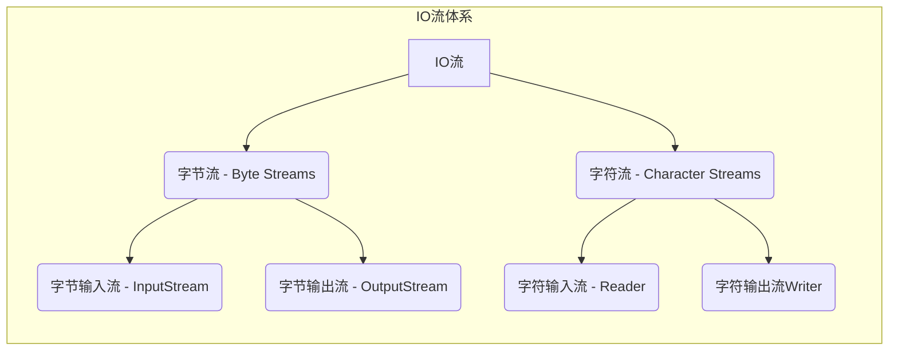
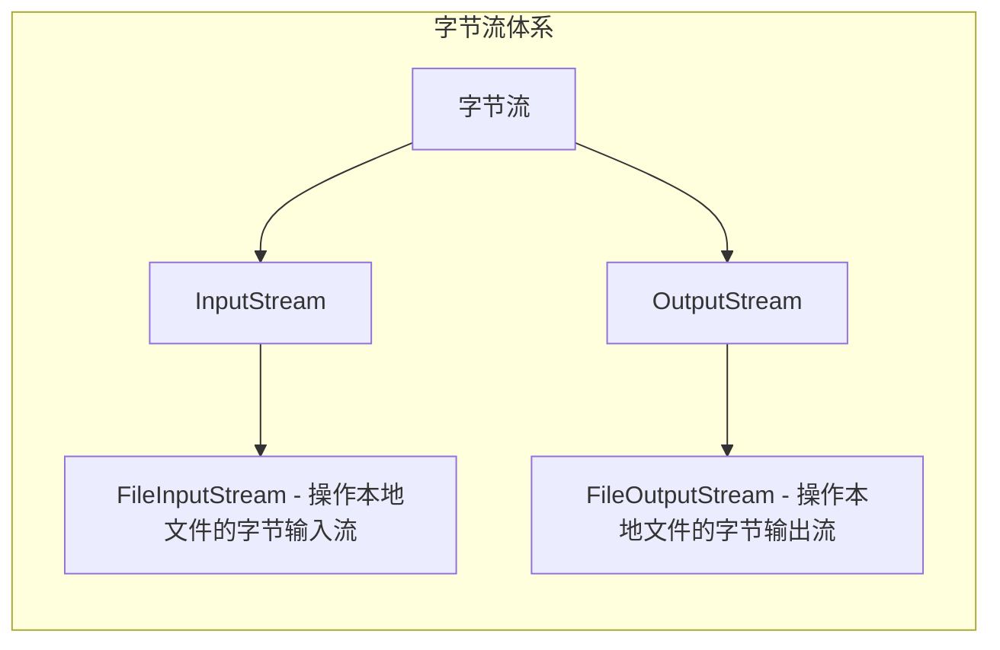

[toc]

# IO流

#### IO流的概述

IO流（输入/输出流）是一种处理数据流的机制，用于在程序和外部设备（如文件或网络连接）之间传输数据。IO流分为**输入流**和**输出流**，用于从外部设备读取数据或向外部设备写入数据。

Java中的IO流主要由**字节流**和**字符流**组成。

* **字节流（Byte Streams）以字节为单位处理数据**。例如，`InputStream`和`OutputStream`是字节流的基本类，用于读取和写入字节数据。字节流可操作所有类型的文件。

* **字符流（Character Streams）以字符为单位处理数据**。例如，Reader和Writer是字符流的基本类，用于读取和写入字符数据。字符流只可操作纯文本文件。
* 纯文本文件可表示为在Windows中用自带的记事本打开且能读懂的文件

Java中的IO流还可分为**节点流**和**处理流**。

* **节点流（Node Streams）直接连接到数据源或数据目标**，如文件或网络连接。即从节点流读取或写入数据，直接与外部设备交互。

* **处理流（Processing Streams）是通过连接到节点流而创建的**。处理流充当节点流的包装器，可以对数据进行额外的处理（如缓冲、过滤或转换），以提供更高级别的功能。

IO流在处理文件操作、网络通信、数据库操作等方面都有广泛应用。通过使用不同的IO流来读写数据，可以使程序实现更灵活的输入输出功能。

#### IO流的体系



#### 字节输出流的基本用法



##### FileOutputStream

操作本地文件的字节输出流，可以把程序中的数据写到本地文件中。

###### 书写步骤与细节

1. 创建字节输出流对象

细节1：参数是字符串表示的路径或者是File对象都是可以的
细节2：如果文件不存在会创建一个新的文件，但是要保证父级路径是存在的
细节3：如果文件已经存在，则会清空文件

2. 写出数据

细节：write方法的参数是整数，但是实际上写到本地中的是整数在ASCII上对应的字符

3. 释放资源

细节：每次使用完流后都要释放资源

```java
public static void main(String[] args) throws IOException {
    //创建对象
    FileOutputStream fos = new FileOutputStream("指定文件的路径");
    //写出数据
    fos.write(97);//a
    //释放资源
    fos.close();
}
```

###### FileOutputStream原理

FileOutputStream是Java标准库中用于将数据写入文件的类之一。它的原理是通过创建一个字节流连接到文件上，并将数据写入该流，最终写入文件。

具体而言，FileOutputStream操作的流程如下：

1. 创建一个FileOutputStream对象，可以提供文件路径作为参数。
2. 通过调用`write`方法，将数据写入输出流。数据可以是字节数组、字节序列或单个字节。
3. 写入的数据首先缓存在内存中，当缓冲区满（或者在流被关闭时）或`flush`方法被调用时，数据将被刷新并写入到目标文件。
4. 在数据写入完成后，使用`close`方法关闭输出流。关闭输出流会触发刷新缓冲区，确保数据被完全写入目标文件，并释放相关的系统资源。

在FileOutputStream的工作过程中，会涉及到系统I/O的相关操作，如文件系统的读写和缓冲区的管理。因此，在使用FileOutputStream时需要注意异常处理和资源释放，以避免可能的资源泄漏或文件损坏。

###### FileOutputStream写数据的三种方式

| 方法名称                               | 说明                         |
| -------------------------------------- | ---------------------------- |
| void write(int b)                      | 一次写一个字节数据           |
| void write(byte[] b)                   | 一次写一个字节数组数据       |
| void write(byte[] b, int off, int len) | 一次写一个字节数组的部分数据 |

###### 换行和续写

1. 换行：在写入需要换行的位置，插入换行符"\n"。

```java
public class FileOutputStreamExample {
    public static void main(String[] args) {
        String filePath = "example.txt";
        String line1 = "This is line 1";
        String line2 = "This is line 2";

        try (FileOutputStream fos = new FileOutputStream(filePath)) {
            byte[] bytes1 = (line1 + "\n").getBytes();
            byte[] bytes2 = (line2 + "\n").getBytes();

            fos.write(bytes1);
            fos.write(bytes2);

            System.out.println("数据写入成功！");
        } catch (IOException e) {
            System.out.println("数据写入失败：" + e.getMessage());
        }
        
        fos.close();
    }
}
```

2. 续写：在创建`FileOutputStream`对象时，将第二个参数设置为`true`，即追加模式（append mode）。

```java
public class FileOutputStreamExample {
    public static void main(String[] args) {
        String filePath = "example.txt";
        String line1 = "This is line 1";
        String line2 = "This is line 2";

        try (FileOutputStream fos = new FileOutputStream(filePath, true)) {
            byte[] bytes1 = (line1 + "\n").getBytes();
            byte[] bytes2 = (line2 + "\n").getBytes();

            fos.write(bytes1);
            fos.write(bytes2);

            System.out.println("数据续写成功！");
        } catch (IOException e) {
            System.out.println("数据续写失败：" + e.getMessage());
        }
        
        fos.close();
    }
}
```

##### FileInputStream

操作本地文件的字节输入流，可以把本地文件中的数据读取到程序中来

###### 书写步骤与细节

1. 创建字节输入流对象

细节：如果文件不存在，就直接报错

2. 写数据

细节1：一次读一个字节，读出来的是数据在ASCII上对应的数字

细节2：读到文件末尾，read返回-1

3. 释放资源

细节：每次使用完流后必须释放资源

```java
public static void main(String[] args) throws IOException {
    //创建对象
    FileInputStream fis = new FileInputStream("指定文件的路径");
    //读取数据，调用一个read方法，只会读取一个字符
    int b1 = fis.read();
    System.out.prinyln((char)b1);
    //释放资源
    fis.close();
}
```

###### FileInputStream循环读取

```java
public class FileInputStreamExample {
    public static void main(String[] args) throws FileNotFoundException, IOException {
        String filePath = "example.txt";
        FileInputStream fis = new FileInputStream(filePath);
        
        int byteRead;
        //read：表示读取数据，而且是读取一个数据就移动一次指针
        while ((byteRead = fis.read()) != -1) {
            // 打印读取到的字节
            System.out.print((char) byteRead);
        }
        
        System.out.println("\n数据读取完成！");
        
        fis.close();
    }
}
```

#### 文件拷贝

##### 文件拷贝的基本代码

```java
//拷贝小文件
public static void main(String[] args) throws IOException {
    //创建对象
    FileInputStream fis = new FileInputStream("待拷贝文件的目录");
    FileOutputStream fos = new FileOutputStream("拷贝后的文件目录");
    //拷贝
    //核心思想：边读边写
    int b;
    while((b = fis.read()) != -1){
        fos.write(b);
    }
    //释放资源
    //规则：先开的最后关闭
    fos.close();
    fis.close();
}
```

##### FileInputStream读取的问题

如果拷贝的文件过大，那么速度会非常慢，因为拷贝是FileInputStream一次读取一个字节


###### FileInputStream一次读取多个字节

| 方法名称                       | 说明                   |
| ------------------------------ | ---------------------- |
| public int read()              | 一次读一个字节数据     |
| public int read(byte[] buffer) | 一次读一个字节数组数据 |

注意：一次读一个字节数组的数据，每次读取会尽可能把数组装满。

```java
public static void main(String[] args) throws IOException {
    /**
     * 文件拷贝
     */
    //1.创建对象
    FileInputStream fis = new FileInputStream("待拷贝文件的目录");
    FileOutputStream fos = new FileOutputStream("拷贝后的文件目录");
    //2.拷贝
    int len;
    byte[] bytes = new byte[1024 * 1024 * 5];
    while((len = fis.read(bytes)) != -1){
        fos.write(bytes, 0, len);
    }
    //3.释放资源
    fos.close();
    fis.close();
}
```

#### IO流中不同JDK版本捕获异常的方式

```java
/**
 * JDK7 : IO流中捕获异常的方法
 * try后面的小括号中写创建对象的代码
 * 注意：只有实现了AutoCloseable接口的类，才能在小括号中创建对象
 */
try(FileInputStream fis = new FileInputStream("待拷贝文件的目录");
    FileOutputStream fos = new FileOutputStream("拷贝后的文件目录")){
    //2.拷贝
    int len;
    byte[] bytes = new byte[1024 * 1024 * 5];
    while((len = fis.read()) != -1){
        fos.write(bytes, 0, len);
    }
} catch (IOException e){
    e.printStackTrace();
}
```

```java
public static void main(String[] args) throws FileNotFoundException {
    /**
     * JDK9 : IO流中捕获异常的方法
     */
    FileInputStream fis = new FileInputStream("待拷贝文件的目录");
    FileOutputStream fos = new FileOutputStream("拷贝后的文件目录");
    try(fis; fos){
        //2.拷贝
        int len;
        byte[] bytes = new byte[1024 * 1024 * 5];
        while((len = fis.read()) != -1){
            fos.write(bytes, 0, len);
        }
    } catch (IOException e){
        e.printStackTrace();
    }
}
```

#### 字符集

了解

1. ASCII、GBK、Unicode
2. 乱码的产生与注意事项

#### 编码和解码的代码实现

编码的方法

| String类中的方法                           | 说明                 |
| ------------------------------------------ | -------------------- |
| public byte[] getBytes()                   | 使用默认方式进行编码 |
| public byte[] getBytes(String charsetName) | 使用指定方式进行编码 |

解码的方法

| String类中的方法                         | 说明                 |
| ---------------------------------------- | -------------------- |
| String(byte[] bytes)                     | 使用默认方式进行解码 |
| String(byte[] bytes, String charsetName) | 使用指定方式进行解码 |

```java
//编码
String str1 = "待编码文本";
byte[] bytes = str1.getBytes("UTF-8");
System.out.println(Arrays.toString(bytes));
//解码
String str2 = new String(bytes, "UTF-8");
System.out.println(str2)
```

#### 字符流

```markdown
	字符流底层就是字节流
	字符流 = 字节流 + 字符集
```

##### 特点

* 输入流：一次读一个字节，遇到中文时，根据其字符集判断读取多少个字节

* 输出流：底层会把数据按照指定的编码方式进行编码，变成字节再写道文件中

##### 使用场景

* 对于纯文本文件进行读写操作

##### 字符输入流

###### FileReader

1. 创建字符输入流对象

| 构造方法                           | 说明                       |
| ---------------------------------- | -------------------------- |
| public FileReader(File file)       | 创建字符输入流关联本地文件 |
| public FileReader(String pathname) | 创建字符输入流关联本地文件 |

2. 读取数据

| 成员方法                       | 说明                         |
| ------------------------------ | ---------------------------- |
| public int read()              | 读取数据，读到末尾返回-1     |
| public int read(char[] buffer) | 读取多个数据，读到末尾返回-1 |

* 细节1：按字节进行读取，遇到中文，一次读多个字节，读取后解码，返回一个整数
* 细节2：读到文件末尾了，read方法返回-1

3. 释放资源

| 成员方法           | 说明            |
| ------------------ | --------------- |
| public int close() | 释放资源 / 关流 |

**空参`read()`方法**

```java
public static void main(String[] args) throws IOException {
    //创建对象并关联本地文件
    FileReader fr = new FileReader("文件目录");

    /**
     * 读取数据read()
     * read()细节：
     *      1.read()：默认是逐个字节读取，如果遇到中文就会一次读取多个
     *      2.在读取后，方法底层还会进行解码并转成十进制，最终会把十进制做为返回值
     *        十进制数据也是表示在字符集上的数字
     *      例如：文件里的中文的二进制数据：11100110 10110001 1000101
     *           read方法进行读取，解码并转成十进制27721
     * 那么，如果想看到所对应的汉字，就把十进制数据强转成char类型
     */
    int ch;
    while((ch = fr.read()) != -1){
        System.out.println((char) ch);
    }

    //3.释放资源
    fr.close();
}
```

**有参`read()`方法**

```java
public static void main(String[] args) throws IOException {
    //1.创建对象
    FileReader fr = new FileReader("文件目录");
    //2.读取数据
    char[] chars = new char[2];
    int len;
    //read(chars)：有参read()把读取数据、解码、强转三步合并，把强转之后的字符放到数组当中
    //有参的read方法：空参的read + 强转类型转换
    while((len = fr.read()) != -1){
        System.out.println(new String(chars, 0, len));
    }
    //3.释放类型
    fr.close();
}
```

##### 字符输出流

###### FileWriter构造方法

| 构造方法                                           | 说明                             |
| -------------------------------------------------- | -------------------------------- |
| public FileWriter(File file)                       | 创建字符输出流关联本地文件       |
| public Filewriter(String pathname)                 | 创建字符输出流关联本地文件       |
| public Filewriter(File file, boolean append)       | 创建字符输出流关联本地文件，续写 |
| public Filewriter(String pathname, boolean append) | 创建字符输出流关联本地文件，续写 |

###### FileWriter成员方法

| 成员方法                                  | 说明                   |
| ----------------------------------------- | ---------------------- |
| void write(int c)                         | 写出一个字符           |
| void write(string str)                    | 写出一个字符串         |
| void write(String str, int off, int len)  | 写出一个字符串的一部分 |
| void write(char[] cbuf)                   | 写出一个字符数组       |
| void write(char[] cbuf, int off, int len) | 写出字符数组的一部分   |

###### FileWriter书写细节

1. 创建字符输出流对象

细节1：参数是字符串表示的路径或者File对象都是可以的
细节2：如果文件不存在会创建一个新的文件，但是要保证父级路径是存在的
细节3：如果文件已经存在，则会清空文件，加里不想清空可以打开续写开关

2. 写数据

细节：如果wite方法的参数是整数，但是实际上写到本地文件中的是整数在字符集上对应的字符

3. 释放数据

细节：每次使用完流之后都要释放资源

##### 字符流原理解析

###### 字符输入流底层原理

```markdown
1.创建字符输入对象
    底层：关联文件，并创建缓冲区（长度为8192的字节数组）

2.读取数据
	底层：1.判断缓冲区中是否有数据可以读取
	     2.缓冲区没有数据：就从文件中获取数据，装到缓冲区中，每次尽可能装满缓冲区。如果文件中也没有数据，返回-1
		 3.缓冲区有数据：就从缓冲区读取
空参的read方法：一次读取一个字节，遇到中文一次读多个字节，把字节解码并转成十进制返回
有参的read方法：把读取字节，解码，强转三步合并了，强转之后的字符放到数组中
```

###### 字符输出流底层原理

| 成员方法            | 说明                               |
| ------------------- | ---------------------------------- |
| public void flush() | 将缓冲区中的数据，刷新到本地文件中 |
| public void close() | 释放资源/关流                      |

* fush刷新：刷新之后，还可以继续往文件中写出数据
* close关流：断开通道，无法再往文件中写出数据

##### 字节流和字符流的使用场景

```markdown
字节流
	拷贝任意类型的文件
字符流
	读取纯文本文件中的数据
	往纯文本文件中写出数据
```

##### 案例

###### 拷贝文件夹

```java
public static void main(String[] args) throws IOException {
    /**
     * 拷贝多级文件夹
     */

    //1.创建待拷贝文件路径和文件拷贝后的文件路径
    File file = new File("C:\\Users\\JunXing\\Desktop\\Typora学习笔记");
    File newFile = new File("C:\\Users\\JunXing\\Desktop\\01");

    //2.创建文件拷贝方法
    fileCopy(file, newFile);
}

private static void fileCopy(File file, File newFile) throws IOException{

    newFile.mkdirs();

    //3.进入待拷贝文件夹
    File[] listFiles = file.listFiles();
    //4.判断待拷贝文件是文件还是文件夹
    for (File listFile : listFiles) {
        //4.1.如果是文件
        if(listFile.isFile()){
            //4.1.1.如果是文件则拷贝进入新文件夹
            //使用FileInputStream从文件夹中读取内容
            FileInputStream fis = new FileInputStream(listFile);
            //FileOutputStream fos = new FileOutputStream(newFile);
            //在这里，我们使用 listFile 对象作为要读取的文件对象，
            //并使用 new File(newFile, listFile.getName()) 来创建要写入的新文件对象。这样做可以确保将文件拷贝到目标文件夹中。
            FileOutputStream fos = new FileOutputStream(new File(newFile, listFile.getName()));
            int len; //记录读取的字节长度
                     //如果len != -1，说明读取到了内容；如果len = -1，说明没有内容读取
            byte[] bytes = new byte[1024];
            while((len = fis.read(bytes)) != -1){
                fos.write(bytes, 0, len);
            }
            //4.1.2.释放资源
            fos.close();
            fis.close();
        } else {
            //4.2.如果是文件夹
            //4.2..1.如果是文件夹则递归判断下一个文件
            fileCopy(listFile, new File(newFile, listFile.getName()));
        }
    }
}
```

###### 加密和解密文件

```java
final static String OLDFILE = "C:\\Users\\JunXing\\Desktop\\02";
final static String NEWFILE = "C:\\Users\\JunXing\\Desktop\\01";
public static void main(String[] args) throws IOException{
    /**
     * 文件的加密与解密
     */
    //1.创建原始文件对象
    File file = new File(OLDFILE);
    File newfile = new File(NEWFILE);

    encryptFile(file, newfile);
}

private static void encryptFile(File file, File newFile) throws IOException {

    newFile.mkdirs();

    //1.文件加密
    //2.进入目标文件夹
    File[] listFiles = file.listFiles();
    //3.循环判断内容是文件夹还是文件
    for (File listFile : listFiles) {
        if (listFile.isFile()) {
            //4.内容是文件
            //4.1.文件加密（异或一个数）
            //4.2.文件解密（异或同一个数）
            FileInputStream fis = new FileInputStream(listFile);
            FileOutputStream fos = new FileOutputStream(new File(newFile, listFile.getName()));

            byte[] bytes = new byte[1024];
            int len;
            while((len = fis.read(bytes)) != -1){
                for (int i = 0; i < len; i++) {
                    bytes[i] = (byte) (bytes[i] ^ 10);
                }
                //写入修改后数据
                fos.write(bytes, 0, len);
            }
            fis.close();
            fos.close();
        } else {
            //5.内容是文件夹
            //5.1.递归处理
            encryptFile(listFile, new File(newFile, listFile.getName()));
        }
    }
}
```

###### 修改文件数据

```java
public static void main(String[] args) throws IOException {
    //1.读取数据
    //2-1-9-4-7-8
    FileReader fr = new FileReader("src/m11d14/a.txt");
    StringBuilder sb = new StringBuilder();

    int ch;
    while((ch = fr.read()) != -1){
        sb.append((char)ch);
    }
    fr.close();

    //2.排序
    String str = sb.toString();
    String[] arrStr = str.split("-");

    ArrayList<Integer> list = new ArrayList<>();
    for (String s : arrStr) {
        int i = Integer.parseInt(s);
        list.add(i);
    }
    Collections.sort(list);
    System.out.println(list);

    //3.写出
    FileWriter fw = new FileWriter("src/m11d14/a.txt");
    for (int i = 0; i < list.size(); i++) {
        if(i == list.size() - 1){
            fw.write(list.get(i) + "");
        } else {
            fw.write(list.get(i) + "-");
        }
    }
    fw.close();
}
```

```java
public static void main(String[] args) throws IOException {
    //1.读取数据
    //2-1-9-4-7-8
    FileReader fr = new FileReader("src/m11d14/a.txt");
    StringBuilder sb = new StringBuilder();
    int ch;
    while((ch = fr.read()) != -1){
        sb.append((char)ch);
    }
    fr.close();
    System.out.println(sb);

    //2.排序
    Integer[] arr = Arrays.stream(sb.toString().split("-"))
            .map(Integer::parseInt)
            .sorted()
            .toArray(Integer[]::new);

    //3.写出
    FileWriter fw = new FileWriter("src/m11d14/a.txt");
    String s = Arrays.toString(arr).replace(", ", "-");
    String result = s.substring(1, s.length() - 1);
    fw.write(result);
    fw.close();
}
```


#### 字节流和字符流的区别

在Java的IO流体系中，字节流和字符流是两种不同的流类型，主要区别如下：

1. 处理数据类型：字节流以字节为单位进行读写操作，适用于二进制数据（如图片、音频、视频等）和文本数据。字符流以字符为单位进行读写操作，适用于处理文本数据。
2. 输入输出方式：字节流以字节流的方式进行输入输出，通常用于处理二进制数据或字节流。字符流以字符流的方式进行输入输出，通常用于处理文本数据。
3. 编码方式：字节流不关心数据的具体编码方式，可以直接处理原始数据，适用于处理任意编码的数据。字符流则依赖于具体的编码方式，基于字符集进行编码和解码操作，默认使用平台默认的字符集。
4. 处理效率：字节流处理数据的效率通常比字符流高。因为字符流需要进行字符编码和解码的过程，而字节流直接处理原始数据，少了编码解码的开销。

#### 知识点：StringBuilder

`StringBuilder` 是一个可变的字符串类，它允许在已有字符串的基础上进行字符串的修改和拼接操作，而不会创建新的字符串对象。它属于 `java.lang` 包，常用于需要频繁修改字符串内容的场景。

使用 `StringBuilder` 类可以有效地避免频繁创建字符串对象，提高字符串操作的性能。下面是创建 `StringBuilder` 对象并进行常见操作的示例代码：

```java
// 创建空的 StringBuilder 对象
StringBuilder sb = new StringBuilder();

// 追加字符串
sb.append("Hello");

// 在指定位置插入字符串
sb.insert(5, " World");

// 替换字符串
sb.replace(6, 11, "Java");

// 删除指定位置的字符
sb.deleteCharAt(5);

// 删除指定范围内的字符
sb.delete(5, 9);

// 反转字符串
sb.reverse();

// 获取最终结果
String result = sb.toString();

System.out.println(result); // 输出：avaJ
```


[返回文首](#IO流)
