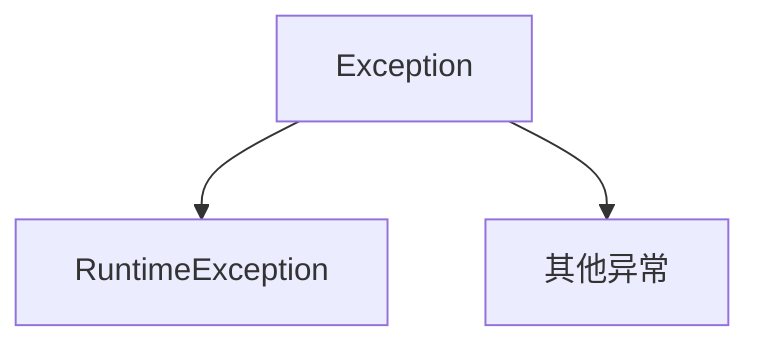

[toc]

### 异常

#### 异常体系介绍



```markdown
异常是什么？
	程序中可能出现的问题
异常体系的最上层父类是谁？异常分为几类？
	父类：Exception
	异常分为两类：编译时异常、运行时异常
编译时异常和运行时异常的区别？
	编译时异常：
		没有继承RuntimeExcpetion的异常，直接继承于Excpetion
		编译阶段就会错误提示
	运行时异常：
		RuntimeException本身和子类
		编译阶段没有错误提示，运行时出现
```

#### 编译时异常和运行时异常

```markdown
Java文件 -----> 字节码文件
		Javac命令
编译时异常：
	编译阶段就要进行处理的异常，作用在于提醒程序员（如：日期解析异常)

字节码文件 -----> 运行结果
		Java命令
运行时异常：
	RuntimeException及其子类，编译阶段不需要处理。代码运行时出现的异常（如：数组索引越界异常）
	一般是由于参数传递错误带来的问题
```

#### 异常的作用 

##### 作用一

```markdown
错误信息传递：
	异常机制允许我们在出现错误时将错误信息传递给程序的调用者或其他部分。当异常发生时，可以通过抛出异常对象来传递错误信息，并通过异常的类型进行分类。这使得代码可以在不同的层级之间传递错误信息，从而实现更好的错误处理和调试。
```

##### 作用二

```markdown
异常处理：
    Java的异常机制提供了一种结构化的方式来处理程序中的错误情况。通过捕获和处理异常，我们可以在程序出现异常时采取适当的措施，使程序能够优雅地处理异常情况而不会终止执行。异常处理可以使用try-catch块来捕获异常并执行相应的处理逻辑，或者可以将异常继续抛出给上层调用者处理。
    
    异常作用二：异常可以作为方法内部的一种特殊返回值，以便通知调用者底层的执行情况
```

#### 异常的处理方式

##### JVM默认的处理方式

1.把异常的名称，异常原因及异常出现的位置等信息输出在了控制台
2.程序停止执行，异常下面的代码不会再执行了

##### try-catch捕获异常

```java
//格式：
try{
	可能出现异常的代码;
} catch (异常类名 变量名) {
	异常的处理代码;
}
//目的 
//当代码出现异常时，可以让出现继续往下执行

int[] arr = {1,2,3,4,5,6};

try{
	System.out.println(arr[10]);
    //此处出现了异常，程序就会在这里创建一个ArrayIndexOutofBoundsException对象
	//new ArrayIndexoutofBoundsException();
	//使用这个对象到catch的小括号中对比，看括号中的变量是否可以接收这个对象
	//如果能被接收，就表示该异常就被捕获（抓住），执行catch里面对应的代码
	//当catch里面所有的代码执行完毕，继续执行try.,.catch体系下面的其他代码
}catch(ArrayIndexOutofBoundsException e){
	//如果出现了ArrayIndexOutofBoundsException异常，我该如何处理
	System.out.printiIn("索引越界了")；
}
System.out.printin("程序继续执行")；
```

###### try-catch捕获异常的四个问题


##### 抛出异常
