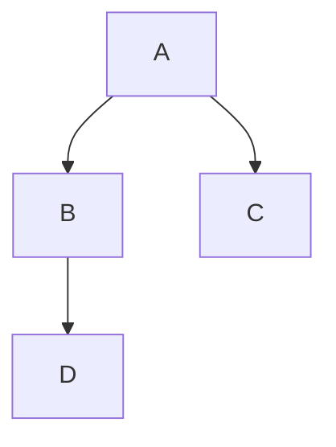
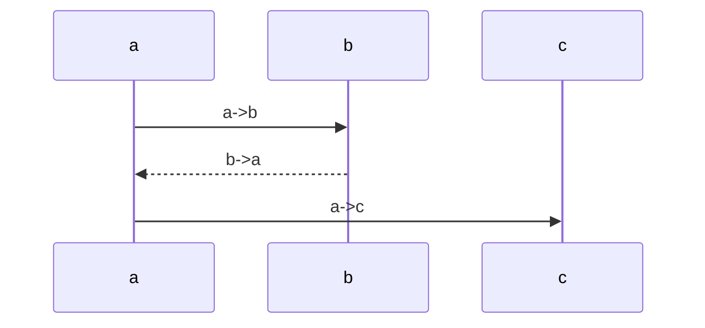
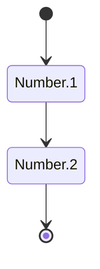
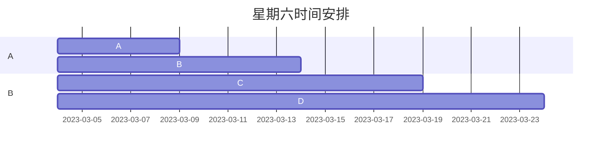
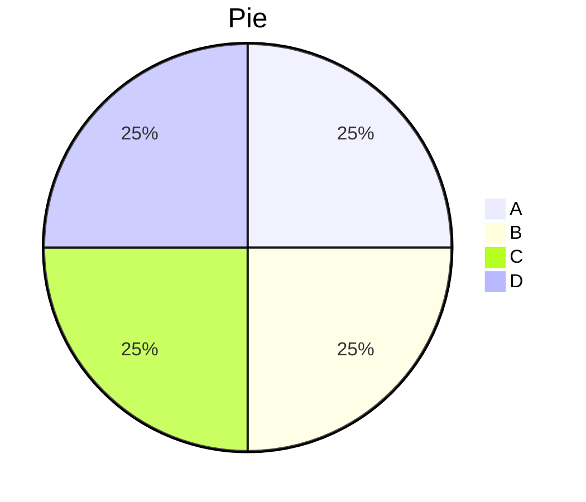

## Mermaid

---

[TOC]

> Mermaid 支持绘制非常多种类的图，常见的有时序图、流程图、类图、甘特图等等。
>
> 先在 Typora 中，输入 **```mermaid** 然后敲击回车，即可初始化一张空白图。

#### **流程图**

> 语法解释：`graph` 关键字就是声明一张流程图，`TD` 表示的是方向，这里的含义是 Top-Down 由上至下。



#### **时序图**

> 语法解释：`->>` 代表实线箭头，`-->>` 则代表虚线。



#### **状态图**

> 语法解释：`[*]` 表示开始或者结束，如果在箭头右边则表示结束。



#### **类图**

==[参考资料，后面再填](https://blog.csdn.net/u012787240/article/details/112847071)==

#### **甘特图**

> 甘特图一般用来表示项目的计划排期。



#### **饼图**

> 饼图使用 `pie` 表示，标题下面分别是区域名称及其百分比。



